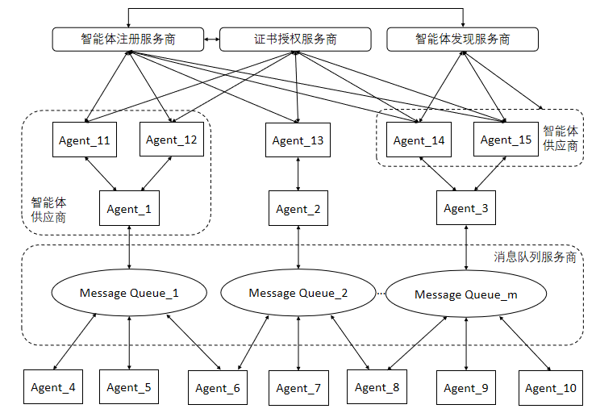

[首页](../README.md)

ACPs：面向智能体互联的智能体协作协议体系（ACPs-spec-v01.00）

# 1. 文档定义

本文档为 ACPs 智能体协作协议体系整体介绍，版本号 v01.00。

文档全称为 ACPs-spec-v01.00。

文档编写者：刘军（北京邮电大学），李珂（北京邮电大学），陈科良（北京邮电大学），禹可（北京邮电大学），胡晓峰（北京邮电大学）。

# 2. 智能体协作协议概述

智能体互联是指智能体通过协议或接口，与其他智能体连接实现跨平台、跨领域的互联协作共同完成复杂任务的过程。智能体互联的目的，是为了突破单智能体能力限制，同时打破厂商自有多智能体框架的束缚，以开放互联的形式构建一个智能体之间可以实现平等互通、互联协作、互惠互利的平台，使得智能体之间可以自组织、自协商形成一个高效协作网络，实现根据用户任务需求动态调整资源分配和协作方式，提高智能体系统的整体能力和效率。

作为智能体互联核心基础，智能体互联相关协议，近期成为科研界和产业界的关注热点。继 Anthropic 公司提出用于连接大模型与工具之间的 Model Contex Protocol（MCP）后，Google 公司提出了用于智能体之间通信的 Agent2Agent（A2A）协议。除此之外，中国的独立研究者常高伟在 2024 年 6 月也发布了面向智能体网络的 Agent Network Protocol（ANP）。更多的研究工作和成果，在最新的 Arxiv 论文《A Survey of AI Agent Protocols》中进行了较为全面的介绍。尽管这些智能体互联场景下的相关协议研究的出现，极大地推动了智能体互联的发展，但这些协议的在最初设计时都仅关注了一个特定的场景，例如 MCP 重点考虑大模型如何调用工具，A2A 的目标是解决企业间智能体互联的问题，ANP 考虑相对全面，但为了保证智能体之间的自由互联空间，没有对智能体的可管理性进行太多的设计。

本文从未来智能体互联将成为关键性网络基础设施的愿景出发，在以上研究成果的基础上，尝试从更加全局化的视角，提出并设计了一套面向智能体互联的智能体协作协议体系 Agent Collaboration Protocols（ACPs）。该协议体系涵盖智能体注册、智能体发现、智能体交互等多个功能领域，以弥补现有研究的不足，为智能体互联的坚实发展提供新的思路和方法。需要特别指出的是，本文是首次构建 ACPs 协议体系，可能还存在一定的不完备和不足，我们欢迎读者指正和交流，共同完善该协议体系。

# 3. 智能体协作协议体系中的实体及相互关系

智能体协作协议体系（ACPs）中的实体及相互关系如下图所示。

智能体协作协议体系中的实体包括以下类别：

● 智能体注册服务商（Agent Registration Service Provider，ARSP）：安全可控的智能体应在智能体注册服务商进行能力注册，并获得身份标识。在智能体互联中，考虑到智能体的数量庞大、区域分布广泛，可以存在多个智能体注册服务商，每个智能体注册服务商负责管理一定数量的智能体注册。

● 证书授权服务商（Certificate Authority Service Provider，CASP）：安全可控的智能体应在可信的证书授权服务商处获得与身份标识对应的数字身份证书。在智能体互联中，考虑到智能体的数量庞大、区域分布广泛，可以存在多个证书授权服务商，每个证书授权服务商负责管理一定数量的智能体身份证书。为确保智能体身份证书发放的可靠性，证书授权服务商与智能体注册服务商需要同步信息。

● 智能体发现服务商（Agent Discovery Service Provider，ADSP）：智能体发现服务商通过规范的流程和协议，支持智能体之间识别和理解某个或若干智能体所具备的能力。考虑到智能体的数量庞大和区域分布广泛，智能体发现的查询请求呈现大量和广泛的特点，因此智能体互联中可存在多个智能体发现服务商，以便智能体或用户能够发现并利用各智能体的能力。为确保能力信息的准确性和时效性，智能体发现服务商与智能体注册服务商需要同步信息。

● 智能体（Agents）：智能体是智能体互联中的核心执行单元。每个智能体是由特定的智能体供应商（Agent Provider）创建的，并且在提供服务之前需要先在智能体注册服务商处进行注册并获得身份标识，然后从证书授权服务商获取身份证书。智能体收到用户分配的任务后，当需要其他智能体协作完成任务时，需要通过智能体发现服务商寻找合适的协作智能体，以达成任务目标。

● 消息队列（Message Queue）：消息队列是为了支持智能体之间的复杂动态交互需求而存在的消息管理组件。消息队列由特定的消息队列服务商构建并提供能力服务。由于智能体互联中智能体数量会快速增加，由此带来的交互消息数量也将十分庞大，因此会存在较多的消息队列服务商提供消息队列服务。

# 4. 智能体协作协议体系定义的规范

智能体协作协议体系（Agent Collaboration Protocols，ACPs）是为保障异构智能体之间高效协作、支持多样化智能体互联应用而设计的标准化通信与交互协议体系与上图中实体属性和实体间接口序号对应，ACPs 中定义了如下规范和协议：

(1)智能体身份码（Agent Identity Code，AIC）规范

(2)智能体能力描述（Agent Capability Specification，ACS）规范

(3)智能体可信注册（Agent Trusted Registration，ATR）规范

(4)智能体身份认证（Agent Identity Authentication，AIA）规范

(5)智能体发现协议（Agent Discovery Protocol，ADP）规范

(6)智能体交互协议（Agent Interaction Protocol，AIP）规范

(7)发现与注册数据同步（Discovery and Registration Coordination，DRC）规范

# 5. 补充说明

本文介绍了北邮智能体互联研究小组提出并初步定义的面向智能体互联的智能体协作协议体系（Agent Collaboration Protocols，ACPs）。ACPs 协议体系的提出，是从未来智能体互联能成为关键性网络基础设施的角度出发，尝试从更加全局化的视野，为智能体互联的坚实发展提供新的思路和方法。需要特别说明的是，本文是研究团队首次阐述 ACPs 协议体系的基本框架和思路，在具体实现层面可能还存在一定的不足，我们欢迎读者指正和交流，共同完善该协议体系。在后续工作中，我们将基于 ACPs 框架进一步进行细化，阐述 ACPs 协议体系的实现细节和参考实现。
