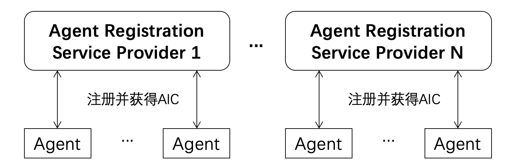
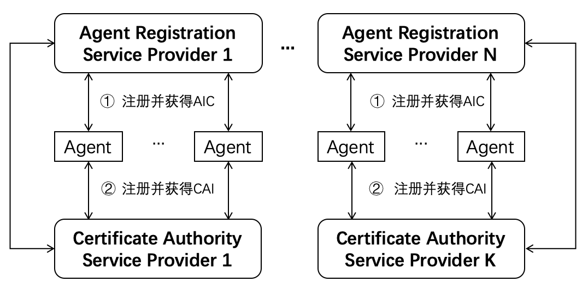
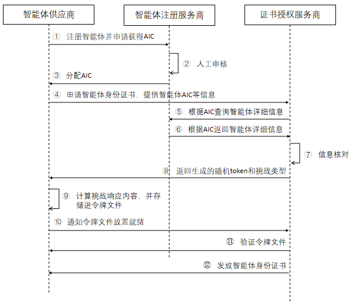

[首页](../README.md)

ATR：智能体可信注册（ACPs-spec-ATR-v01.00）

# 1. 文档定义

本文档为 ACPs 智能体协作协议体系中的智能体可信注册（Agent Trusted Registration ，ATR）流程定义，版本号 v01.00。

文档全称为 ACPs-spec-ATR-v01.00。

文档编写者：刘军（北京邮电大学），高歌（中国电子技术标准化研究院），宋昊哲（北京邮电大学），李胤铭（北京邮电大学），禹可（北京邮电大学），胡晓峰（北京邮电大学）。

# 2. 智能体注册流程介绍

智能体互联要能成为一个安全可靠的智能体系统，运行于其中具备自主执行任务能力的智能体应为安全可靠的实体。要达到这一目标，每个智能体应具备以下两个必要条件：

（1）从智能体注册服务商获得全局唯一的身份标识，该标识为智能体身份码（Agent Identity Code，AIC，参见 ACPs 协议体系中的 AIC 标准定义文档）；

（2）从智能体注册服务商指定的证书授权服务商获得可用于身份验证的数字证书，称为智能体身份证书（Certificate of Agent Identity，CAI）。

满足以上两个条件的智能体注册流程，可称之为智能体可信注册流程。

在 ACPs 协议体系中的 AIC 标准定义文档中已经定义，每个智能体应具备一个唯一的 AIC，其来自于智能体首次注册的智能体注册服务商（Agent Registration Service Provider，ARSP）。在智能体互联中，可以存在多个智能体注册服务商，每个服务商应为经过共识认可（例如管理机构认证）的服务实体。智能体获取 AIC 的流程如下图所示，每个智能体可以根据自身需要，选择不同的智能体注册服务商（ARSP）进行注册，并获得分配的 AIC。

智能体获取 AIC 后，还需从证书授权服务商（Certificate Authority Service Provider, CASP）获取智能体身份证书。在智能体互联中，可以存在多个证书授权服务商，每个服务商应为经过共识认可（例如管理机构认证）的服务实体。完整的可信注册过程如下图所示。

# 3. 智能体可信注册流程定义

智能体可信注册详细流程如下图所示。

图中所示步骤如下：

(1) 智能体供应商向智能体注册服务商发送注册请求注册智能体，请求中需包含 ACS 全部或部分信息、ca-challenge-url，申请获取 AIC；

(2) 智能体注册服务商对注册请求的内容进行人工审核；

(3) 智能体注册服务商审核通过后，为智能体分配 AIC；

(4) 如果智能体供应商是首次在证书授权服务商（运行 CA Server）申请证书，需要先在 CA Server 注册账户，注册成功后获得JWK。然后使用 CA Client 工具向 CA Server 申请智能体身份证书，请求中需附带 AIC；

(5) CA Server 根据智能体 AIC 向智能体注册服务商请求获取智能体的详细信息；

(6) 智能体注册服务商根据 AIC 返回智能体详细信息给 CA Server。返回的详细信息中需包含AIC、provider信息以及 ca-challenge-url，ca-challenge-url 用于存放证书发放机构所需的域名持有者身份校验文件。在该路径下智能体供应商应存放对应的令牌文件，文件路径要求如下：`<ca-challenge-url>/<aic>/<token>`；

(7) CA Server 对智能体详细信息进行核对；

(8) 信息核对通过后，CA Server 生成随机 token 并向智能体供应商返回授权URL，然后智能体供应商向这些 URL 发送请求以获取具体的挑战信息，包括挑战类型和token；

(9) 智能体供应商使用获得的 token 和自己的 JWK 指纹计算 `key_authorization` 值作为挑战响应的内容。为了让 CA Server 进行挑战验证，智能体供应商需要使用 Challenge Server ，其url为`ca-challenge-url`，然后将挑战响应内容发送到 Challenge Server 并按规定文件路径存储为令牌文件，以便 CA Server 后续验证； 

(10) Challenge Server 响应设置完成后，智能体供应商向 CA Server 发送通知，表示已准备好接受挑战验证；

(11) CA Server 向 Challenge Server 发起验证请求，Challenge Server 返回令牌文件中存储的挑战响应内容；

(12) CA Server 成功验证挑战响应内容后，CA Server 根据从智能体注册服务商获取的智能体详细信息构造证书，最后智能体供应商向 CA Server 发起证书下载请求获取最终的智能体身份证书。
# 4. 补充说明

本文档定义的智能体可信注册流程充分考虑了可管理性和兼容性，并无偿提供给相关研发人员和机构参考。我们欢迎从事智能体研发和智能体互联协议制定的其他业界同仁支持并采纳此流程定义，以形成利于互联互通和兼容性好的智能体注册服务。
