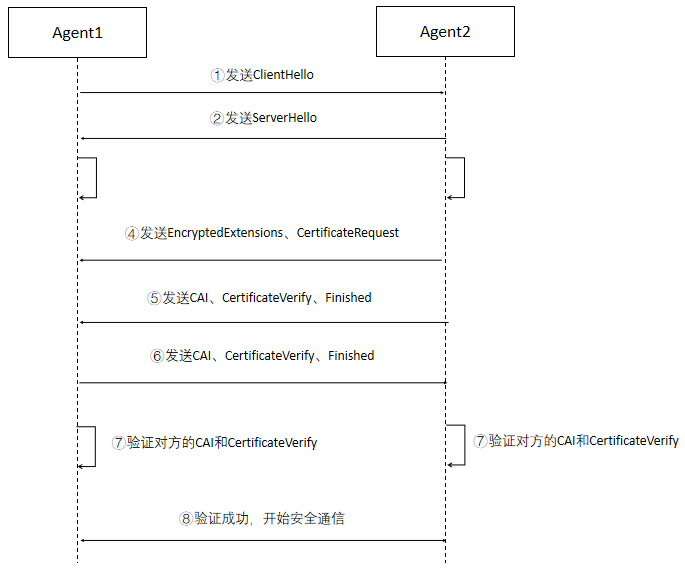
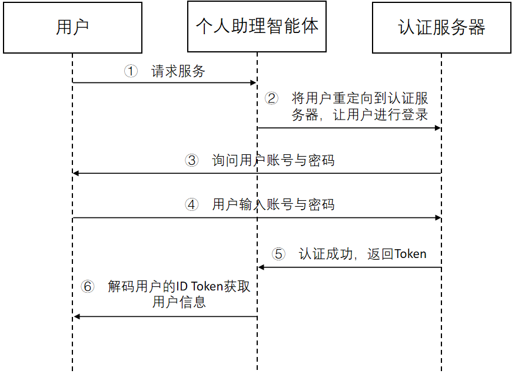

[首页](../README.md)

AIA：智能体身份认证流程（ACPs-spec-AIA-v01.00）

# 1. 文档定义

本文档为 ACPs 智能体协作协议体系中的智能体身份认证（Agent Identity Authentication，AIA）流程定义，版本号 v01.00。

文档全称为 ACPs-spec-AIA-v01.00。

文档编写者：禹可（北京邮电大学），宋昊哲（北京邮电大学），李胤铭（北京邮电大学），刘军（北京邮电大学），胡晓峰（北京邮电大学）。

# 2. 智能体身份认证流程介绍

智能体互联要能成为一个安全可靠的智能体系统，运行于其中具备自主执行任务能力的智能体应为安全可靠的实体，在 ACPs 协议体系的智能体可信注册流程标准中，为每个智能体提供了两个必要条件：智能体身份码（Agent Identity Code，AIC）、智能体身份证书（ Certificate of Agent Identity，CAI）。本文档对具备这两个条件的智能体如何进行身份认证的详细流程进行定义。

# 3. 智能体身份认证流程定义

智能体身份的认证可使用多种认证协议。推荐使用TLS1.3协议的mTLS方式。首先发起请求的智能体是mTLS的客户端（如图中Agent1），接受请求的智能体是mTLS的服务端（如图中Agent2）。完整的mTLS握手流程如下图所示：

智能体身份认证过程主要分为密钥交换（Key Exchange）、服务端参数（Server Parameters）、身份认证（Authentication）三步，除了密钥交换部分，其他步骤都是加密进行的。

首先是密钥交换，包括：

（1）客户端发送ClientHello消息，包含：
* 一个随机数：用于密钥派生。
* 支持的TLS协议版本列表。
* 加密套件Cipher Suites：一组对称加密算法/HKDF哈希算法对。
* Certificate Authorities：指定支持的CASP，后续需要服务端返回相应机构颁发的证书。
* signature_algorithms：用来提供客户端可以进行的证书签名的哈希算法，保证客户端可以对证书进行验证，如ECDSA、RSA-PSS等。
* supported_groups：提供了客户端支持的ECDHE算法的圆锥曲线，如x25519、secp256r1等。
* key_share：包含使用的椭圆曲线或有限域参数组、客户端生成的临时公钥。
* psk_key_exchange_modes：用于明确客户端支持的PSK密钥交换模式，如PSK-only或PSK with (EC) DHE。
* pre_shared_key：用于在TLS握手过程中为PSK模式提供支持。
* 还可能包含其他扩展字段。
  
（2）服务端向客户端回复ServerHello消息，包含：
* 一个随机数：用于密钥派生。
* 选择的TLS协议版本。
* 选择的加密套件Cipher Suites。
* key_share：包含使用的椭圆曲线或有限域参数组、服务端生成的临时公钥。
* pre_shared_key：如果客户端使用了预共享密钥（PSK）模式，服务端会在这里确认使用的PSK。
* 还可能包含其他扩展字段。

（3）服务端和客户端使用对方key_share中的临时公钥和自己的临时私钥，通过ECDHE算法协商出一个共享的对称密钥，然后使用HKDF算法派生出多个密钥用于加密通信，后面发送的所有消息都是加密过的消息。密钥交换完成；

然后是服务端参数，包括：

（4）服务端发送CertificateRequest（表明需要客户端发送客户端证书）、Encrypted Extensions（用于携带那些不是用来确定加密参数的 ClientHello 扩展的响应）；

最后是身份认证，包括：

（5）服务端发送CAI（服务端证书）、CertificateVerify（选择一个ClientHello中signature_algorithms提供的签名算法，然后使用服务端证书中的公钥所对应的私钥对之前所有握手消息的哈希值进行签名）、Finished（握手结束）；

（6）客户端发送CAI（客户端证书）、CertificateVerify、Finished（握手结束）；

（7）客户端和服务端对对方的CAI和CertificateVerify进行验证，验证步骤如下：
* 双方收到 CAI 后，通过以下的步骤验证对方的 CAI：

    ①　先将 CAI 的明文和签名分开，然后将明文使用与 CASP 相同的Hash算法进行映射，得到第一个Hash值Hash1。

    ②　使用 CASP 的公钥对 CAI 中签名进行解密，得到第二个Hash值Hash2。

    ③　比对Hash1和Hash2是否相同，相同则表明 CAI 未被篡改，其中的明文信息全部可信。

    然后对 CAI 中的明文信息进行验证，主要将对方的 AIC 和 CAI 中的AIC进行比对。
* 双方收到CertificateVerify后，使用signature_algorithms指定的签名算法和对方证书中的公钥对此签名进行解密得到Hash3，然后使用计算所有握手消息的哈希值Hash4，比对Hash3和Hash4是否相同。

（8） 验证成功后即可开始加密数据传输。

# 4. 用户身份认证流程

当用户使用智能体（如个人助理）时，推荐使用OIDC协议验证用户的身份，主要流程如下：

（1）用户向个人助理智能体请求服务；

（2）个人助理智能体将用户重定向到认证服务器（第三方）让其进行登录操作；

（3）认证服务器询问用户账号与密码；

（4）用户告知认证服务器账号与密码；

（5）认证服务器认证成功后，生成ID Token、Access Token等并将其返回给个人助理智能体；

（6）个人助理智能体使用认证服务器的公钥将收到的ID Token进行解码，验证签名的有效性以及iss、sub、aud等字段。验证完成后即成功认证了用户的合法身份。

认证流程如下所示：

# 5. 补充说明

本文档定义的智能体身份认证流程充分考虑了可管理性和兼容性，并无偿提供给相关研发人员和机构参考。我们欢迎从事智能体研发和智能体互联协议制定的其他业界同仁支持并采纳此流程定义，以形成利于互联互通和兼容性好的智能体身份认证机制。
