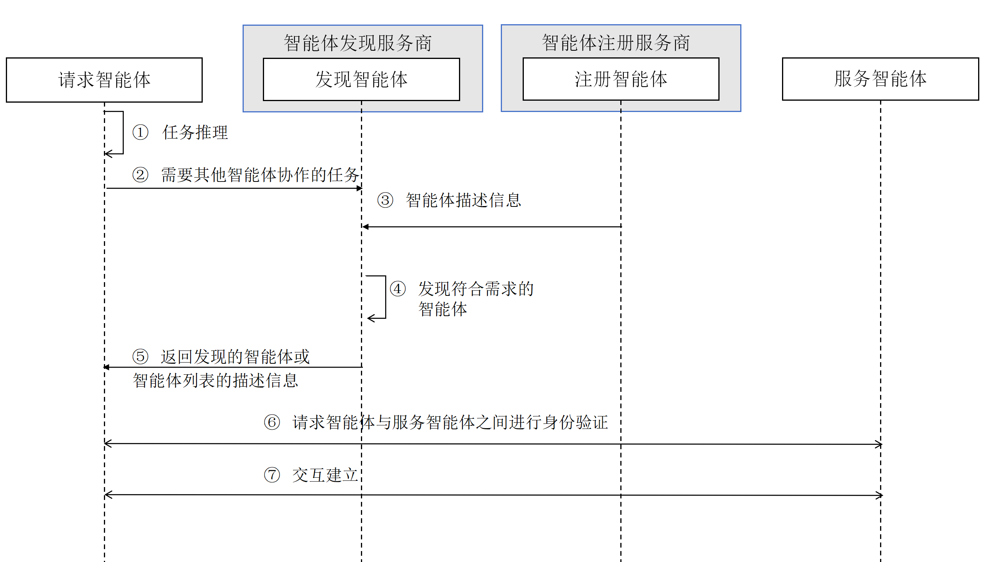

[首页](../README.md)

ADP：智能体发现过程（ACPs-spec-ADP-v01.00）

# 1. 文档定义

本文档为 ACPs 智能体协作协议体系中的智能体发现流程（Agent Discovery Protocol，ADP）标准定义，版本号 v01.00。

文档全称为 ACPs-spec-ADP-v01.00。

文档编写者：李珂（北京邮电大学），禹可（北京邮电大学），胡晓峰（北京邮电大学），张茂彬（北京邮电大学），王垚烨（北京邮电大学），高歌（中国电子技术标准化研究院），刘军（北京邮电大学）。

# 2. 智能体发现流程介绍

智能体互联要能成为一个安全可靠的智能体系统，需有一个规范灵活的智能体发现过程，以实现智能体之间的协作。本文档定义智能体发现过程（Agent Discovery Protocol，ADP），遵从以下原则并实现相应的目标：

(1)满足异构智能体的协作需求：服务请求智能体可以通过 ADP 机制快速发现满足其能力需求的智能体；

(2)支持动态环境下的自主协作：ADP 机制应能适应因为智能体的加入、退出或变化导致的智能体互联高动态特性，确保服务请求智能体能获取到满足其能力需求的智能体；

# 3. 智能体发现流程中的角色定义和交互过程

智能体发现流程中涉及的角色与交互过程如下图所示。

智能体发现流程涉及以下角色：

● 请求智能体：请求智能体是根据任务目标需要其他智能体提供服务进行协作的服务请求发起方。

● 发现智能体：由智能体发现服务商提供的智能体，其功能是接收智能体发现请求，并返回匹配检索结果。发现智能体的信息可以通过在请求智能体所在环境中的配置获得（类似 DNS 服务器配置），也可以通过请求智能体向自己所在的智能体注册服务商发起询问获得。

● 注册智能体：由智能体注册服务器提供的智能体，其功能是对外提供智能体注册服务。

● 服务智能体：由智能体供应商创建并管理的提供服务的智能体。

智能体发现流程包括以下步骤：

(1)请求智能体对任务进行推理；

(2)请求智能体拆解出需要与其他智能体协作的任务，向发现智能体发送智能体发现请求，并携带需要协作的任务信息；

(3)注册智能体向发现智能体发送智能体描述信息，发现智能体存储该信息；注册智能体与发现智能体之间的信息同步参考《DRC：发现与注册数据同步协议》

(4)发现智能体根据请求中需要协作的任务信息与存储的智能体描述信息进行匹配；

(5)将符合需求的智能体或智能体列表信息返回给请求智能体。

(6)请求智能体根据自己的策略，从列表中选择需要协作的智能体(服务智能体)，与他们进行身份验证；

(7)在身份验证成功后，请求智能体与服务智能体建立连接，共同协作完成任务。

# 4. 补充说明

本文档定义的智能体发现流程充分考虑了可管理性和兼容性，并无偿提供给相关研发人员和机构参考。我们欢迎从事智能体研发和智能体互联协议制定的其他业界同仁支持并采纳此流程定义，以形成利于互联互通和兼容性好的智能体发现机制。
