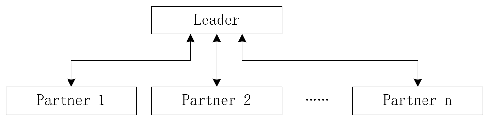
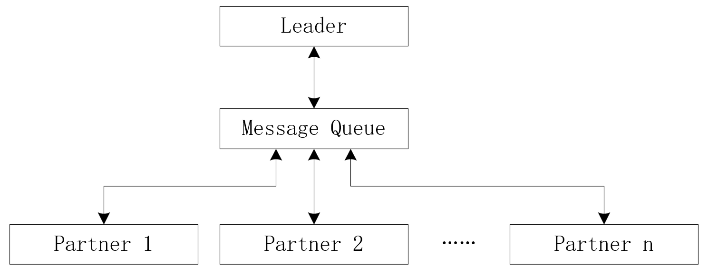
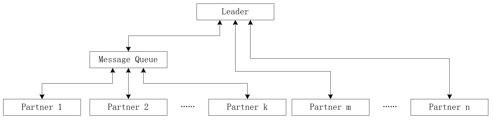
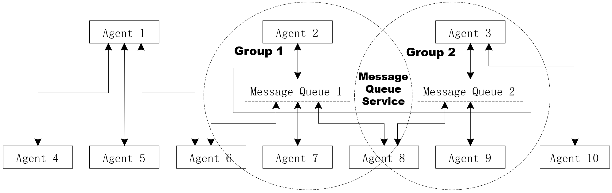
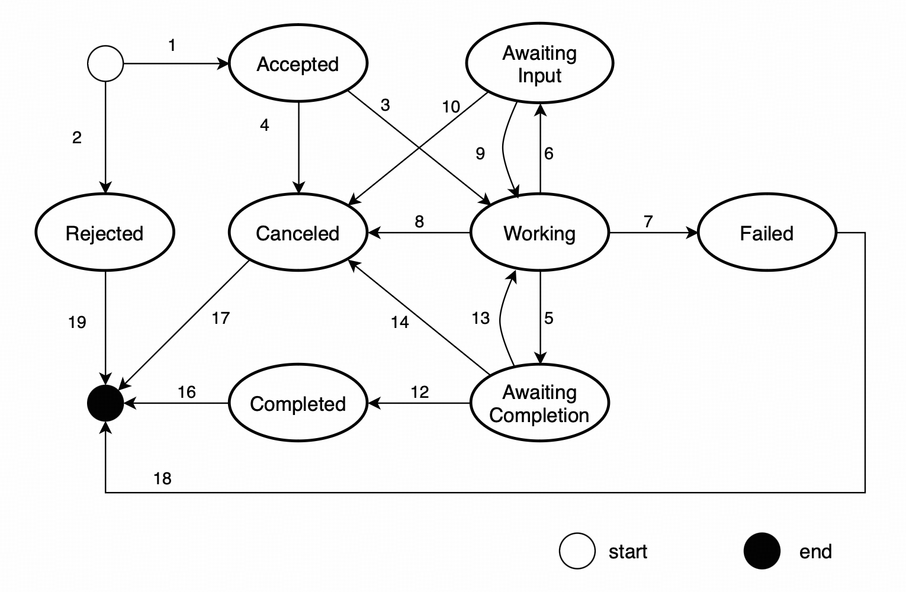
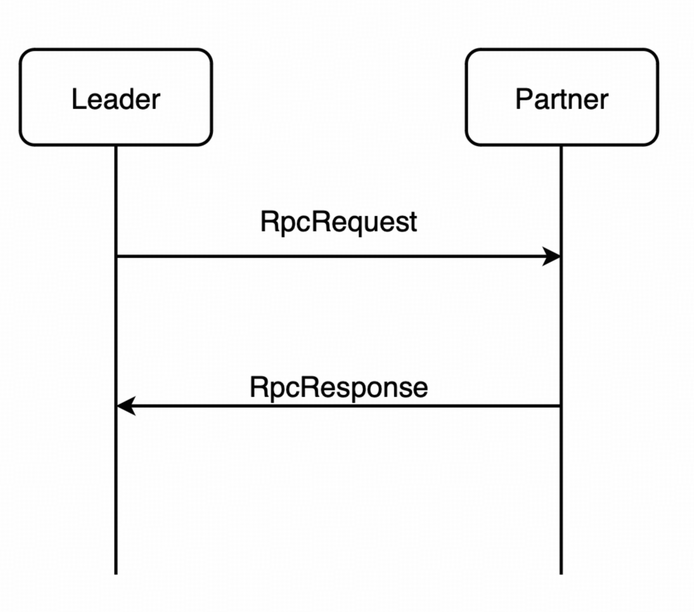
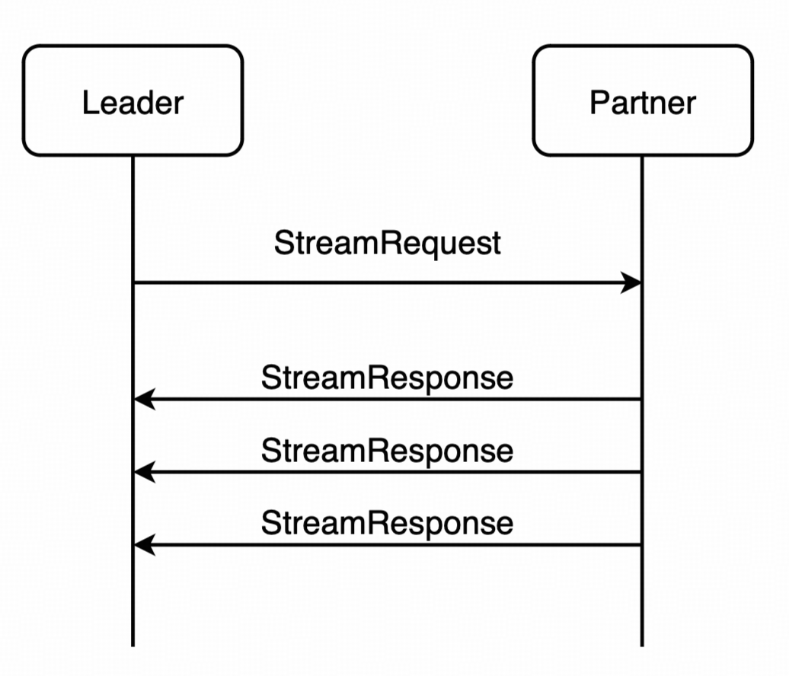
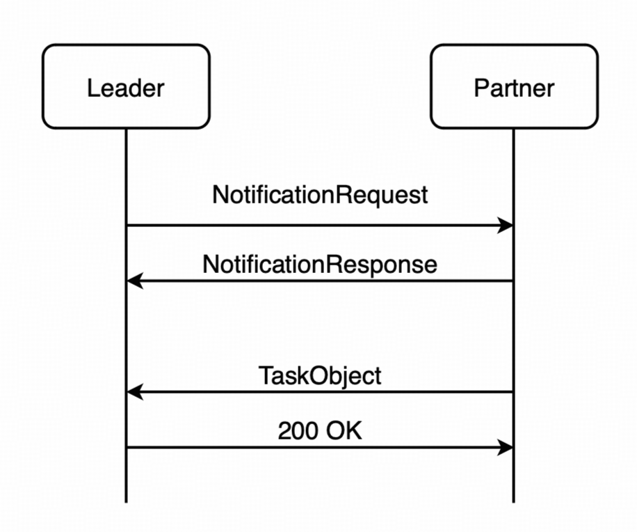

[首页](../README.md)

AIP：智能体交互协议（ACPs-spec-AIP-v01.00）

# 1. 文档定义

本文档为 ACPs 智能体协作协议体系中的智能体交互协议（Agent Interaction Protocol，AIP）标准定义，版本号 v01.00。

文档全称为 ACPs-spec-AIP-v01.00。

文档编写者：禹可（北京邮电大学），李胤铭（北京邮电大学），宋昊哲（北京邮电大学），郭小练（北京邮电大学），刘军（北京邮电大学），李珂（北京邮电大学），胡晓峰（北京邮电大学），马镝（北京邮电大学），高歌（中国电子技术标准化研究院）。

# 2. 智能体交互协议介绍

智能体互联要能成为一个安全可靠的智能体系统，需要一套规范的流程和协议支持智能体之间的交互。为构建一个强大、可扩展且实用的多智能体协作环境，ACPs 协议体系中的智能体交互协议（Agent Interaction Protocol，AIP）着重关注智能体之间的交互，其关键目标在于：

(1)协作性：提供标准化的机制以促进智能体间深度协作，使智能体能够主动委托任务（将子任务分配给更合适的智能体）和高效交换上下文信息（共享环境感知、目标状态、知识等）。

(2)互操作性：通过定义标准化的信息格式、语义和交互模式等，屏蔽底层智能体平台、编程语言或内部实现的差异，使由不同团队开发、运行在不同环境、具备不同能力的异构智能体系统能够无缝地发现彼此、理解交互内容并有效协作。

(3)灵活性：支持多样化的交互需求，不强制单一的交互模式，而是允许智能体根据场景选择最合适的交互模式，并能适应不同的信息负载和服务质量要求。

(4)异步性：支持长时间运行的任务，确保请求、中间状态更新和最终结果能够可靠地、按需地传递。智能体发起请求（如委托一个耗时任务）后，无需持续等待响应，可以立即处理其他事务。

本文档将详细阐述智能体交互协议（AIP）的各方面细节，包括角色定义、交互模式、交互流程和协议定义。

# 3. 智能体交互协议中的角色定义和交互模式

## 3.1 角色定义

在智能体交互过程中，存在以下两种角色：

(1)领导者（Leader）：在智能体交互中，领导者是指发布任务并组织交互的智能体。在一次完整的交互中，只能有一个领导者。

(2)参与者（Partner）：在智能体交互中，参与者是指接受任务并提供服务的智能体。参与者接受来自领导者的任务后执行并返回执行结果。

## 3.2 交互模式（Interaction Mode）

在智能体交互协议中，Leader 和 Partner 之间有三种交互模式：

### (1)直连模式（Direct Interaction Mode）

直连模式下，由 Leader 创建并维护一个 Session，相关的智能体在同一个 Session 中协作完成任务。该 Session 中 Leader 与每个 Partner 直接进行交互，而 Partner 之间无交互。Leader 与 Partner 之间的交互可以采用远程调用、流式传输和异步通知三种实现方式（具体参见第 6 节）。直连模式下智能体的交互如下图所示：



### (2)群组模式（Grouping Interaction Mode）

群组模式下，由 Leader 创建并维护一个 Session，该 Session 中智能体间的交互信息通过一个消息队列（Message Queue）进行分发。Leader 创建 Session 后，邀请相关的 Partner 加入群组并在消息队列中订阅该 Session 中的信息。 然后，Leader 和 Partner 之间的交互信息发送至消息队列，然后由消息队列进行分发。同一群组内的智能体均可通过消息分发模块发送和接收消息。群组模式下智能体的交互如下图所示：



### (3)混合模式（Hybrid Interaction Mode）

混合模式下，由 Leader 创建并维护一个 Session，在该 Session 内，Leader 既可通过直连模式与 Partner 交互，也可通过群组模式与 Partner 交互。混合模式下智能体的交互如下图所示:



## 3.3 交互网络（Interaction Network）

在智能体交互场景下，智能体以直连与群组两种模式与其他智能体建立连接，部分智能体可同时隶属于不同群组并复用消息队列服务，进而构成动态的智能体交互网络。某一时刻下的智能体交互结构如下图所示:



# 4. 智能体交互协议中的核心概念

智能体间的交互基于以下核心概念进行：

## 4.1 会话（Session）

每个会话对应一个面向用户需求的多智能体交互过程，由Leader创建，由唯一编号标识，用于管理该过程中涉及的Partner、产生的所有消息及任务。

## 4.2 任务（Task）

智能体交互中的基本工作单元，具有明确定义的生命周期与状态。Leader 负责任务的创建与终止，Partner（一个或多个）则负责任务的具体执行与结果反馈。在任务执行的过程中，Partner 会动态更新`status`字段, 从而维护 Task 的状态（如任务暂停、工作中等），Leader 通过发送 command 消息来主导任务的执行（如取消任务、宣布任务完成等）。

Task 结构定义如下：

```typescript
export interface Task {
  /**
   * 对象类型标识符
   * 对于Task对象，此值总是'task'，用于运行时类型识别
   * @example "task"
   */
  readonly type: "task";

  /**
   * 任务的唯一标识符
   * 由Leader为新任务生成，可以使用UUID格式确保全局唯一性
   * @example "task-123e4567-e89b-12d3-a456-426614174000"
   */
  id: string;

  /**
   * 发送者标识符
   * 在群组模式中用于标识任务的发送者，直连模式下不需要此字段
   * @example "agent-leader-001"
   */
  senderId?: string;

  /**
   * 任务的当前状态
   * 包含状态枚举值、变更时间和相关数据项
   */
  status: TaskStatus;

  /**
   * 智能体在任务执行期间生成的产出物集合
   * 可选字段，包含任务生成的所有有形输出
   * @example [{ type: "text", content: "分析报告..." }, { type: "file", url: "report.pdf" }]
   */
  products?: Product[];

  /**
   * 任务期间交换的消息历史
   * 记录与此任务相关的所有交互消息，按时间顺序排列
   * @example [{ type: "message", id: "msg-001", command: "start" }, { type: "message", id: "msg-002", command: "update" }]
   */
  messageHistory?: Message[];

  /**
   * 任务状态变化的历史记录
   * 记录任务从创建到完成的所有状态变迁，用于审计和调试
   * @example [{ state: "Accepted", stateChangedAt: "2025-09-01T10:00:00+08:00" }, { state: "Working", stateChangedAt: "2025-09-01T10:05:00+08:00" }]
   */
  statusHistory?: TaskStatus[];

  /**
   * 群组标识符
   * 只有在群组模式下才会有此字段，用于标识任务所属的群组
   * @example "group-collaborative-analysis-001"
   */
  groupId?: string;

  /**
   * 会话的唯一标识符
   * 由Leader生成和维护，用于关联属于同一会话的所有任务和消息
   * 注意：参与交互的只有sessionId，而不是完整的session对象
   * @example "session-123e4567-e89b-12d3-a456-426614174000"
   */
  sessionId: string;
}

export interface TaskStatus {
  /**
   * 任务的当前状态
   * 使用TaskState枚举值表示任务在生命周期中的当前阶段
   */
  state: TaskState;

  /**
   * 状态变更的时间戳
   * 使用ISO 8601日期时间字符串格式，默认使用北京时间时区
   * @example "2025-09-01T14:30:00+08:00"
   */
  stateChangedAt: string;

  /**
   * 状态变更对应的数据项数组
   * 包含与状态变更相关的内容，可以是文本、文件等多种类型
   * @example [{ type: "text", text: "任务已开始执行" }, { type: "file", name: "config.json", url: "..." }]
   */
  dataItems?: DataItem[];
}

export enum TaskState {
  /**
   * 任务已被接受
   * Partner收到Leader发过来的开始任务的消息，根据自己的能力，
   * 决定接受这个任务，则返回给Leader接受的新状态
   */
  Accepted = "accepted",

  /**
   * 任务正在执行中
   * Partner在接受后并不一定立刻开始处理任务，
   * 等Partner真正开始工作时把状态改为Working
   */
  Working = "working",

  /**
   * 等待输入状态
   * Partner已暂停并等待Leader输入新数据或进一步指令
   */
  AwaitingInput = "awaiting-input",

  /**
   * 等待完成确认状态
   * Partner认为Task已经完成，并随这个状态改变附上完成的Products，
   * 期待Leader完成当前任务。如果Leader认为Partner的产出物不满足需要，
   * 可以选择不结束这个任务，继续提供新的数据让Partner改进回答
   */
  AwaitingCompletion = "awaiting-completion",

  /**
   * 任务已成功完成
   * 所有工作已完成，产出物已交付，任务进入终态
   */
  Completed = "completed",

  /**
   * 任务已被取消
   * 任务被用户或Leader主动取消，或者等待不到必要的补充信息，任务不再继续执行，是外部因素引起的。
   */
  Canceled = "canceled",

  /**
   * 任务执行失败
   * 任务在执行期间因错误、异常或其他问题而失败，是内部执行问题引起的。
   */
  Failed = "failed",

  /**
   * 任务被拒绝
   * 任务被智能体拒绝且未开始执行，通常由于能力不匹配或资源不足
   */
  Rejected = "rejected",
}
```

**任务的状态**

（1）任务接收（Accepted）
（2）任务拒绝（Rejected）
（3）任务继续执行（Working）
（4）任务等待输入（AwaitingInput）
（5）任务等待完成（AwaitingCompletion）
（6）任务完成（Completed）
（7）任务失败（Failed）
（8）任务取消（Canceled）

**状态转移规则**
任务状态的转移遵循以下规则：

- 开始后任务状态可以为 Accepted、Rejected（注意，不是先进入 Accepted 再 Rejected，而是判断后直接进入对应状态）。
- 从 Accepted 可以转移到 Working 或 Canceled。
- 从 Working 可以转移到 AwaitingInput、AwaitingCompletion、Canceled 或 Failed。
- 从 AwaitingInput 可以转移到 Working 或 Canceled。
- 从 AwaitingCompletion 可以转移到 Completed、Working 或 Canceled。
- Completed、Canceled、Failed 和 Rejected 是终态，不能再转移到其他状态。

以下几个命令可用于请求任务状态的变更：

- Start：开始任务，任务状态从无到 Accepted 或 Rejected。其它状态下如果收到相同 TaskID 的 Start 命令将被忽略。
- Continue：继续任务，用于 AwaitingInput 和 AwaitingCompletion 状态。其它状态下若收到 Continue 命令将被忽略。
- Cancel：取消任务。用于 Accepted、Working、AwaitingInput 和 AwaitingCompletion 状态。其它状态下若收到 Cancel 命令将被忽略。
- Complete：完成任务。用于 AwaitingCompletion 状态。其它状态下若收到 Complete 命令将被忽略。

**Task状态转移图**

**状态转移表**
| 编号 | 当前状态           | 命令     | 下一个状态         | 说明                                          |
| ---- | ------------------ | -------- | ------------------ | --------------------------------------------- |
| 1/2  | 无                 | Start    | Accepted/Rejected  | 开始任务，任务状态从无到 Accepted 或 Rejected |
| 3    | Accepted           | -        | Working            | 任务获得执行的机会，进入工作状态              |
| 4    | Accepted           | Cancel   | Canceled           | 任务被取消                               |
| 5    | Working            | -        | AwaitingCompletion | 任务提交产出物，进入等待完成状态              |
| 6    | Working            | -        | AwaitingInput      | 任务缺少必要信息，进入等待输入状态            |
| 7    | Working            | -        | Failed             | 由于内部因素，任务执行失败，进入失败状态      |
| 8    | Working            | Cancel   | Canceled           | 任务被取消   |
| 9    | AwaitingInput      | Continue | Working            | 获得新的输入数据，继续任务                    |
| 10   | AwaitingInput      | Cancel   | Canceled           | 任务被取消           |
| 11   | AwaitingInput      | -        | Canceled           | 等待超时，取消任务                            |
| 12   | AwaitingCompletion | Complete | Completed          | 客户对产出物满意，完成任务                    |
| 13   | AwaitingCompletion | Continue | Working            | 客户对产出物不满意，提供了新的数据，继续任务  |
| 14   | AwaitingCompletion | Cancel   | Canceled           | 任务被取消                    |
| 15   | AwaitingCompletion | -        | Completed          | 等待超时，任务成功结束                        |
| 16   | Completed          | -        | -                  | 任务已成功完成，终态                          |
| 17   | Canceled           | -        | -                  | 由于外部因素，任务已被取消，终态              |
| 18   | Failed             | -        | -                  | 由于内部因素，任务执行失败，终态              |
| 19   | Rejected           | -        | -                  | 任务被拒绝且未开始执行，终态                  |

## 4.3 消息（Message）

智能体交互的基本内容单元，由发送方、多种标识符以及所包含的一个或多个数据构成。其中，`senderId`记录了消息的发送方。在群组中，`mentions`字段用于指定应该做出回应的 Partner。`command` 字段用于 Leader 控制任务执行和查询状态。

Message 结构定义如下：
```typescript
export interface Message {
  /**
   * 对象类型标识符
   * 对于Message对象，此值总是'message'，用于运行时类型识别
   * @example "message"
   */
  readonly type: "message";

  /**
   * 消息的唯一标识符
   * 由发送者生成，可以使用UUID格式，确保全局唯一性
   * @example "msg-123e4567-e89b-12d3-a456-426614174000"
   */
  id: string;

  /**
   * 消息发送时间
   * 使用ISO 8601日期时间字符串格式，默认使用北京时间时区
   * @example "2025-09-01T14:30:45+08:00"
   */
  sentAt: string;

  /**
   * 消息发送者角色标识
   * 标识消息的发送者类型：客户端为"leader"，服务为"partner"
   * @example "leader" | "partner"
   */
  senderRole: "leader" | "partner";

  /**
   * 发送消息的智能体的唯一标识符
   * 对应智能体的AIC（Agent Identity Code）
   * @example "agent-chatbot-001"
   */
  senderId: string;

  /**
   * 消息提及的智能体AIC列表
   * 在群组模式中用于指定这个消息应该由哪些partner来处理
   * 其它partner是否处理看自己的判断
   * @example ["agent-analyst-001", "agent-writer-002"]
   */
  mentions?: string[];

  /**
   * 消息的命令类型
   * 指定消息携带的操作指令，如开始、继续、取消等
   */
  command?: TaskCommand;

  /**
   * 命令的参数
   * 为命令提供额外的配置参数，具体内容取决于命令类型
   * @example { "timeout": 3600, "priority": "high" }
   */
  commandParams?: { [key: string]: any };

  /**
   * 构成消息主体的内容部分数组
   * 消息可以由不同类型的多个部分组成，如文本、文件、图片等
   * @example [{ type: "text", text: "请分析这个文件" }, { type: "file", name: "data.csv", url: "..." }]
   */
  dataItems: DataItem[];

  /**
   * 此消息所属任务的ID
   * 将消息关联到特定的任务，便于任务状态跟踪
   * @example "task-987fcdeb-51d3-46e7-8a45-123456789abc"
   */
  taskId?: string;

  /**
   * 此消息所属的群组ID
   * 只有在群组模式下才会有此字段，用于标识消息所属的群组
   * @example "group-collaborative-analysis-001"
   */
  groupId?: string;

  /**
   * 此消息的会话ID
   * 将消息关联到特定的会话，便于会话管理和历史追踪
   * @example "session-123e4567-e89b-12d3-a456-426614174000"
   */
  sessionId?: string;
}

export enum TaskCommand {
  /**
   * 获取任务数据
   * 请求获取任务的当前状态、历史消息等信息
   */
  Get = "get",

  /**
   * 开始任务
   * 指示智能体开始执行新任务
   */
  Start = "start",

  /**
   * 继续任务
   * 对于暂停的任务（如AwaitingInput状态）继续执行，
   * 或者AwaitingCompletion状态时不结束而是继续执行
   */
  Continue = "continue",

  /**
   * 取消任务
   * 停止当前任务的执行，任务进入Canceled状态
   */
  Cancel = "cancel",

  /**
   * 完成任务
   * 标记任务已完成，任务进入Completed状态
   */
  Complete = "complete",

  /**
   * 重连任务流
   * 重新建立任务的流式传输连接，用于网络中断后的恢复
   */
  ReStream = "re-stream",
}

/**
 * Get命令的参数接口
 * 当发送`get`命令的消息时，可以包含以下参数来控制返回的数据范围
 */
export interface GetCommandParams {
  /**
   * 最后消息发送时间戳
   * messageHistory中只包含比lastMessageSentAt新的Message
   * 为null时表示返回所有历史消息
   * 使用ISO 8601日期时间字符串格式，默认使用北京时间时区
   * @example "2025-09-01T10:00:00+08:00" | null
   */
  lastMessageSentAt: string | null;

  /**
   * 最后状态变更时间戳
   * statusHistory中只包含比lastStateChangedAt新的TaskStatus
   * 为null时表示所有历史状态
   * 使用ISO 8601日期时间字符串格式，默认使用北京时间时区
   * @example "2025-09-01T10:00:00+08:00" | null
   */
  lastStateChangedAt: string | null;
}

interface StartCommandParams {
  /**
   * 定义Start命令的request最长多少时间必须响应。单位：毫秒
   */
  responseTimeout?: number;

  /**
   * 定义AwaitingInput和AwaitingCompletion状态下，等待多久算超时。单位：毫秒。
   */
  awaitingInputTimeout?: number;
  awaitingCompletionTimeout?: number;

  /**
   * 定义这个任务的products最大的字节数。
   * Partner在生成产出物时应该遵循这个限制，如果不能遵循可以转为Failed状态，并在数据项中提供详细信息。
   */
  maxProductsBytes?: number;
}
```

## 4.4 产出物（Product）

智能体工作的结果或产品，通常在任务状态为`AwaitingCompletion`时生成。产出物通常包含文档、图像等输出，通过`dataItems`数组支持多种数据类型组合。    

Product 结构定义如下：

```typescript
export interface Product {
  /**
   * 任务范围内产出物的唯一标识符
   * 可以使用UUID格式确保在任务范围内的唯一性
   * @example "product-123e4567-e89b-12d3-a456-426614174000"
   */
  id: string;

  /**
   * 产出物名称
   * 通常是文件名或产出物的简短描述性名称
   * @example "分析报告.pdf" | "数据处理结果.json" | "可视化图表.png"
   */
  name?: string;

  /**
   * 产出物的详细描述
   * 说明产出物的内容、用途或生成方式
   * @example "基于用户数据生成的行为分析报告，包含图表和建议"
   */
  description?: string;

  /**
   * 构成产出物的内容部分数组
   * 可以包含多个不同类型的数据项，如文本、文件、结构化数据等
   * @example [{ type: "text", text: "报告摘要..." }, { type: "file", name: "详细数据.csv", url: "..." }]
   */
  dataItems: DataItem[];
}
```

## 4.5 数据项（DataItem）

智能体交互的最小内容单元，支持多种数据类型，包括文本、文件、结构化数据等，每种类型包含对应的内容和元数据。    

DataItem 结构定义如下：
```typescript
/**
 * 所有数据项共有的基础属性接口
 * 为不同类型的数据项提供通用的元数据表达能力
 */
export interface DataItemBase {
  /**
   * 数据项的元数据
   * 可以用于存储与数据项相关的额外信息，如数据结构描述、编码信息等
   * @example { "encoding": "utf-8", "language": "zh-CN", "schema": "custom-format-v1" }
   */
  metadata?: { [key: string]: any };
}

/**
 * 数据项联合类型
 * 表示可以是文本、文件或结构化数据的任一种类型
 */
export type DataItem = TextDataItem | FileDataItem | StructuredDataItem;

/**
 * 文本数据项接口
 * 用于表示纯文本内容
 */
export interface TextDataItem extends DataItemBase {
  /**
   * 数据项类型标识符
   * 用作判别器，始终为'text'
   * @example "text"
   */
  readonly type: "text";

  /**
   * 文本内容
   * 包含实际的文本字符串数据
   * @example "这是一段示例文本内容"
   */
  text: string;
}

/**
 * 文件数据项接口
 * 用于表示文件内容，支持URL引用或base64编码的内嵌方式
 */
export interface FileDataItem extends DataItemBase {
  /**
   * 数据项类型标识符
   * 用作判别器，始终为'file'
   * @example "file"
   */
  readonly type: "file";

  /**
   * 文件名
   * 包含文件扩展名的完整文件名
   * @example "document.pdf" | "image.png" | "data.csv"
   */
  name?: string;

  /**
   * 文件的MIME类型
   * 标识文件的媒体类型，用于正确处理文件内容
   * @example "application/pdf" | "image/png" | "text/csv"
   */
  mimeType?: string;

  /**
   * 文件的URL地址
   * 指向文件资源的URL，与bytes字段互斥使用
   * @example "https://example.com/files/document.pdf"
   */
  uri?: string;

  /**
   * 文件的base64编码内容
   * 文件内容的base64编码字符串，与uri字段互斥使用
   * 适用于小文件或需要内嵌传输的场景
   * @example "JVBERi0xLjQKMSAwIG9iago8PAovVHlwZSAvQ2F0YWxvZw..."
   */
  bytes?: string;
}

/**
 * 结构化数据项接口
 * 用于表示JSON格式的结构化数据
 */
export interface StructuredDataItem extends DataItemBase {
  /**
   * 数据项类型标识符
   * 用作判别器，始终为'data'
   * @example "data"
   */
  readonly type: "data";

  /**
   * 结构化数据内容
   * 包含任意的JSON结构化数据
   * @example { "user": { "id": 123, "name": "张三" }, "score": 95.5, "tags": ["优秀", "活跃"] }
   */
  data: { [key: string]: any };
}
```
# 5. 智能体交互消息格式

承载智能体交互的传输协议为 HTTP(S)。在此基础上，AIP 协议进一步规定所有智能体间的交互消息均采用 JSON-RPC 2.0标准进行格式化，通过 JSON 格式封装请求/响应数据，明确约定方法调用、参数传递及结果返回的统一结构。

## 5.1 JSON-RPC 数据格式

所有 AIP 定义的客户端交互请求都封装在一个 JSONRPCRequest 对象中。

JSONRPCRequest 结构定义如下：

```typescript
export interface JSONRPCRequest {
  /**
   * JSON-RPC 协议版本
   * 固定为 "2.0"，符合JSON-RPC 2.0规范
   */
  jsonrpc: "2.0";

  /**
   * 方法名称
   * 表示要调用的远程过程，如 "rpc", "stream", "group" 等
   * @example "rpc" | "stream" | "group" | "notification/set"
   */
  method: string;

  /**
   * 请求的唯一标识符
   * 可以是字符串、数字或 null
   * 如果期望得到响应，则必须提供id，响应的id必须与请求中的id相同
   * 如果不期望得到响应，则可以将id设置为null
   * @example "request-123" | 42 | null
   */
  id: string | number | null;

  /**
   * 方法参数
   * 可以是数组或对象，具体格式取决于调用的方法
   * @example { "message": {...} } | ["param1", "param2"]
   */
  params?: any[] | { [key: string]: any };
}
```

所有 AIP 定义的服务端响应都封装在一个 JSONRPCResponse 对象中。

JSONRPCResponse 结构定义如下：

```typescript
export interface JSONRPCResponse {
  /**
   * JSON-RPC 协议版本
   * 固定为 "2.0"，符合JSON-RPC 2.0规范
   */
  jsonrpc: "2.0";

  /**
   * 请求的唯一标识符
   * 与请求中的 ID 对应，用于匹配请求和响应
   * 如果请求中包含id，则响应中必须包含相同的id
   * 如果请求中id无法识别，则响应中的id必须为null
   * @example "request-123" | 42 | null
   */
  id: string | number | null;

  /**
   * 方法调用的结果
   * 如果调用成功则包含结果，与error字段相互排斥
   * @example { "type": "task", "id": "task-001", ... }
   */
  result?: any;

  /**
   * 错误信息
   * 如果调用失败则包含错误对象，与result字段相互排斥
   */
  error?: {
    /**
     * 错误代码
     * 表示错误类型，遵循JSON-RPC 2.0标准
     * @example -32600 | -32601 | -32602 | -32603
     */
    code: number;

    /**
     * 错误消息
     * 描述错误的简要信息
     * @example "Invalid Request" | "Method not found"
     */
    message: string;

    /**
     * 可选的错误数据
     * 提供更多的错误细节和上下文信息
     * @example { "errorType": "CONNECTION_FAILED", "details": {...} }
     */
    data?: any;
  };
}
```

## 5.2 JSON-RPC 错误处理

AIP 协议遵循 JSON-RPC 2.0 规范的错误处理机制，同时定义了特定于智能体交互的错误代码。

### (1)标准 JSON-RPC 错误

以下是 JSON-RPC 2.0 规范定义的标准错误代码：

| 错误代码         | 错误名称         | 错误消息                  | 描述                                                        |
| ---------------- | ---------------- | ------------------------- | ----------------------------------------------------------- |
| -32700           | Parse error      | Invalid JSON payload      | 服务器收到的 JSON 格式不正确                                |
| -32600           | Invalid Request  | Invalid JSON-RPC Request  | JSON 有效但不是有效的 JSON-RPC 请求对象                     |
| -32601           | Method not found | Method not found          | 请求的 RPC 方法（如 "rpc"、"notification"）不存在或不受支持 |
| -32602           | Invalid params   | Invalid method parameters | 方法的参数无效（如类型错误、缺少必需字段）                  |
| -32603           | Internal error   | Internal server error     | 服务器在处理过程中发生意外错误                              |
| -32000 到 -32099 | Server error     | (服务器定义)              | 保留给实现定义的服务器错误。AIP 特定错误使用此范围          |


### (2)AIP 特定错误

以下是 AIP 协议在 JSON-RPC 服务器错误范围（`-32000` 到 `-32099`）内定义的自定义错误代码：

| 错误代码 | 错误名称                      | 错误消息                             | 描述                                                 |
| -------- | ----------------------------- | ------------------------------------ | ---------------------------------------------------- |
| -32001   | TaskNotFoundError             | Task not found                       | 指定的任务 ID 不存在、已过期或已完成并被清除         |
| -32002   | TaskNotCancelableError        | Task cannot be canceled              | 尝试取消不可取消状态的任务（如已完成、失败或已取消） |
| -32003   | NotificationNotSupportedError | Notification is not supported        | 客户端尝试使用通知功能但服务器不支持                 |
| -32004   | UnsupportedOperationError     | This operation is not supported      | 请求的操作或其特定方面不受此服务器智能体实现支持     |
| -32005   | ContentTypeNotSupportedError  | Incompatible content types           | 请求中提供的媒体类型不受智能体或特定技能支持         |
| -32006   | InvalidAgentResponseError     | Invalid agent response type          | 智能体为请求的方法生成了无效响应                     |
| -32007   | GroupNotSupportedError        | Group communication is not supported | 客户端尝试使用群组交互功能但服务器不支持             |
| -32008   | AuthenticationRequiredError   | Authentication required              | 操作需要认证但未提供有效凭据                         |
| -32009   | AuthorizationFailedError      | Authorization failed                 | 认证用户无权执行请求的操作                           |
| -32010   | AccessTokenInvalidError       | Invalid access token                 | 提供的 accessToken 无效、已过期或格式错误            |

**错误响应格式**
错误响应必须遵循 JSON-RPC 2.0 规范，使用 `error` 字段而不是 `result` 字段：

错误响应示例：

```json
{
  "jsonrpc": "2.0",
  "id": "1",
  "error": {
    "code": -32001,
    "message": "Task not found",
    "data": {
      "taskId": "task-not-exist-123",
      "details": "任务可能已完成并被清除，或者任务ID无效"
    }
  }
}
```

# 6. 直连模式的实现方式

直连模式下，AIP 协议支持三种实现方式——远程调用方式、流式传输方式和异步通知方式，用于智能体之间的交互和任务管理：

- 远程调用方式（RPC Style）：基础的 RPC 方法，用于发送即时消息、管理任务状态或执行需要立即响应的操作。请求参数包含消息内容、任务状态等信息。
- 流式传输方式（Streaming Style）：用于流式传输数据的 RPC 方法，适用于大文件分块、实时日志推送或长时间运行的数据传输场景。
- 异步通知方式（Notification Style）：基于事件驱动的异步回调方法，用于智能体在特定条件触发时（如任务状态变更、资源就绪或异常发生）向其他智能体发送通知。

## 6.1 远程调用方式（RPC Style）
下面是基于远程调用方式（RPC Style）​​的智能体交互接口规范，明确了交互的方式及数据格式，用于实现客户端与服务器之间的结构化远程交互。

- **URL**: `rpc`
- **HTTP 方法**: `POST`
- **Request**: `RpcRequest`
- **Response**: `RpcResponse`

### 6.1.1 RpcRequest 定义
`RpcRequest`是智能体间远程调用的标准化请求结构，继承自JSON-RPC 2.0的`JSONRPCRequest`接口：

```typescript
export interface RpcRequest extends JSONRPCRequest {
  /**
   * RPC方法名称
   * 对于基础RPC请求，此值总是"rpc"
   * @example "rpc"
   */
  method: "rpc";

  /**
   * RPC请求参数
   */
  params: {
    /**
     * 要发送的消息对象
     * 包含任务指令、数据内容等信息
     */
    message: Message;
  };
}
```

### 6.1.2 RpcResponse 定义
`RpcResponse`是智能体RPC调用的标准化响应结构，继承自JSON-RPC 2.0的`JSONRPCResponse`接口：

```typescript
export interface RpcResponse extends JSONRPCResponse {
  /**
   * RPC响应结果
   * 可以是任务对象或消息对象，取决于请求的类型和处理结果
   */
  result: Task | Message;
}
```

### 6.1.3 示例

交互示意流程图如下所示：



#### （1）创建 Task

**请求**

```json
{
  "jsonrpc": "2.0",
  "method": "rpc",
  "id": "1",
  "params": {
    "message": {
      "type": "message",
      "id": "msg-5678",
      "sentAt": "2025-09-01T11:58:00+08:00",
      "senderRole": "leader",
      "senderId": "agent-leader-aic",
      "command": "start",
      "dataItems": [
        {
          "type": "text",
          "text": "请帮我做一个3天北京文化主体游的行程安排。"
        }
      ],
      "taskId": "task-1234",
      "sessionId": "session-91011"
    }
  }
}
```

**响应**

- 如果 Partner 拒绝了这个 Task，则返回一个状态为 `Rejected` 的 Task 对象。
- 如果 Partner 接受了这个 Task，且不打算马上执行它，则 Partner 会返回一个状态为 `Accepted` 的 Task 对象。
- 如果 Partner 接受了这个 Task，并且马上开始工作了，则可以返回一个状态为 `Working` 的 Task 对象。
- 如果 Partner 接受了这个 Task，并且马上开始工作了，但是执行过程中出错了，则返回一个状态为 `Failed` 的 Task 对象。
- 如果 Partner 接受了这个 Task，并且马上开始工作了，并且马上得到了结果，则可以返回一个状态为 `AwaitingCompletion` 的 Task 对象，并且附上 Products。

```json
{
  "jsonrpc": "2.0",
  "id": "1",
  "result": {
    "type": "task",
    "id": "task-1234",
    "status": {
      "state": "awaiting-completion",
      "stateChangedAt": "2025-09-01T12:00:00+08:00"
    },
    "products": [
      {
        "id": "product-1",
        "name": "北京文化游行程安排.pdf",
        "description": "3天北京文化主体游的详细行程安排",
        "dataItems": [
          {
            "type": "file",
            "name": "beijing_cultural_tour.pdf",
            "mimeType": "application/pdf",
            "uri": "https://example.com/files/beijing_cultural_tour.pdf"
          }
        ]
      }
    ],
    "sessionId": "session-91011"
  }
}
```
#### （2）继续 Task

- 如果 Partner 在工作过程中需要 Leader 提供更多的信息，则 Partner 会把 Task 状态改为 `AwaitingInput`，并且通过返回的 Task 对象通知 Leader。Leader 收到这个状态的 Task 后，可以通过发送新的 Message 来提供更多的信息，其中的 `command` 是 "Continue"。Partnerer 收到后把 Task 状态改为 `Working` 并返回给 Leader 。
- 如果 Partner 认为 Task 已经完成，并且把状态改为 `AwaitingCompletion`，则 Partner 会通过返回的 Task 对象通知 Leader，并且附上 Products。Leader 收到这个状态的 Task 后，认为 Products 是符合自己期望的产出物，就通过发送新的 Message 来决定结束这个 Task，其中的 `command` 是 "Complete" 。如果 Leader 认为 Partner 的产出物并不满足自己的需要，可以选择不结束这个任务，可以继续提供新的数据，让 Partner 继续给出更好的回答，这时 Message 中的 `command` 是 "Continue"。Partner 收到后把 Task 状态改为 `Working` 并返回给 Leader。

**请求**

```json
{
  "jsonrpc": "2.0",
  "method": "rpc",
  "id": "2",
  "params": {
    "message": {
      "type": "message",
      "id": "msg-6789",
      "sentAt": "2025-09-01T12:02:00+08:00",
      "senderRole": "leader",
      "senderId": "agent-leader-aic",
      "command": "continue",
      "dataItems": [
        {
          "type": "text",
          "text": "请继续完善行程安排，增加一些能亲自体验的文化活动，不要都是观光景点。"
        }
      ],
      "taskId": "task-1234",
      "sessionId": "session-91011"
    }
  }
}
```

**响应**

```json
{
  "jsonrpc": "2.0",
  "id": "2",
  "result": {
    "type": "task",
    "id": "task-1234",
    "status": {
      "state": "working",
      "stateChangedAt": "2025-09-01T12:05:00+08:00"
    },
    "products": [],
    "sessionId": "session-91011"
  }
}
```
#### （3）获取 Task

Leader 可以在任何时候获取一个任务的最新状态。

**请求**

```json
{
  "jsonrpc": "2.0",
  "method": "rpc",
  "id": "3",
  "params": {
    "message": {
      "type": "message",
      "id": "msg-9012",
      "sentAt": "2025-09-01T12:06:00+08:00",
      "senderRole": "leader",
      "senderId": "agent-leader-aic",
      "command": "get",
      "commandParams": {
        "lastMessageSentAt": null,
        "lastStateChangedAt": null
      },
      "dataItems": [],
      "taskId": "task-1234",
      "sessionId": "session-91011"
    }
  }
}
```

**响应**

我们这里展示 Failed 的场景。

```json
{
  "jsonrpc": "2.0",
  "id": "3",
  "result": {
    "type": "task",
    "id": "task-1234",
    "status": {
      "state": "failed",
      "stateChangedAt": "2025-09-01T12:07:00+08:00",
      "dataItems": [
        {
          "type": "text",
          "text": "处理任务时发生错误：无法连接到外部数据源。"
        }
      ]
    },
    "products": [],
    "messageHistory": [
      {
        "type": "message",
        "id": "msg-5678",
        "sentAt": "2025-09-01T11:58:00+08:00",
        "senderRole": "leader",
        "senderId": "agent-leader-aic",
        "command": "start",
        "dataItems": [
          {
            "type": "text",
            "text": "请帮我做一个3天北京文化主体游的行程安排。"
          }
        ],
        "taskId": "task-1234",
        "sessionId": "session-91011"
      },
      {
        "type": "message",
        "id": "msg-6789",
        "sentAt": "2025-09-01T12:02:00+08:00",
        "senderRole": "leader",
        "senderId": "agent-leader-aic",
        "command": "continue",
        "dataItems": [
          {
            "type": "text",
            "text": "请继续完善行程安排，增加一些能亲自体验的文化活动，不要都是观光景点。"
          }
        ],
        "taskId": "task-1234",
        "sessionId": "session-91011"
      },
      {
        "type": "message",
        "id": "msg-9012",
        "sentAt": "2025-09-01T12:06:00+08:00",
        "senderRole": "leader",
        "senderId": "agent-leader-aic",
        "command": "get",
        "dataItems": [],
        "taskId": "task-1234",
        "sessionId": "session-91011"
      }
    ],
    "statusHistory": [
      {
        "state": "accepted",
        "stateChangedAt": "2025-09-01T11:59:00+08:00"
      },
      {
        "state": "working",
        "stateChangedAt": "2025-09-01T12:00:00+08:00"
      },
      {
        "state": "awaiting-completion",
        "stateChangedAt": "2025-09-01T12:05:00+08:00"
      },
      {
        "state": "failed",
        "stateChangedAt": "2025-09-01T12:07:00+08:00",
        "dataItems": [
          {
            "type": "text",
            "text": "处理任务时发生错误：无法连接到外部数据源。"
          }
        ]
      }
    ],
    "sessionId": "session-91011"
  }
}
```
#### （4） 完成 Task

- Partner 认为 Task 已经完成，并且把状态改为 `AwaitingCompletion`。
- Leader 认为 Partner 的产出物是符合自己期望的产出物，就通过发送新的 Message 来决定结束这个 Task，其中的 `command` 是 "Complete" 。Partner 收到后把 Task 状态改为 `Completed` 并返回给 Leader 。

**请求**

```json
{
  "jsonrpc": "2.0",
  "method": "rpc",
  "id": "3",
  "params": {
    "message": {
      "type": "message",
      "id": "msg-7890",
      "sentAt": "2025-09-01T12:09:00+08:00",
      "senderRole": "leader",
      "senderId": "agent-leader-aic",
      "command": "complete",
      "dataItems": [],
      "taskId": "task-1234",
      "sessionId": "session-91011"
    }
  }
}
```

**响应**

```json
{
  "jsonrpc": "2.0",
  "id": "3",
  "result": {
    "type": "task",
    "id": "task-1234",
    "status": {
      "state": "completed",
      "stateChangedAt": "2025-09-01T12:10:00+08:00"
    },
    "products": [],
    "sessionId": "session-91011"
  }
}
```
#### （5）取消 Task

Leader 可以在任何时候取消一个任务。取消任务后，任务状态变为`Canceled`。

**请求**

```json
{
  "jsonrpc": "2.0",
  "method": "rpc",
  "id": "4",
  "params": {
    "message": {
      "type": "message",
      "id": "msg-8901",
      "sentAt": "2025-09-01T12:14:00+08:00",
      "senderRole": "leader",
      "senderId": "agent-leader-aic",
      "command": "cancel",
      "dataItems": [],
      "taskId": "task-1234",
      "sessionId": "session-91011"
    }
  }
}
```

**响应**

```json
{
  "jsonrpc": "2.0",
  "id": "4",
  "result": {
    "type": "task",
    "id": "task-1234",
    "status": {
      "state": "canceled",
      "stateChangedAt": "2025-09-01T12:15:00+08:00"
    },
    "products": [],
    "sessionId": "session-91011"
  }
}
```

## 6.2 流式传输方式（Streaming Style）
在直连模式下，通过Server Send Event（SSE）流式传输方式，允许 Leader 和 Partner 之间进行单向的大量数据传输和单向的实时消息发送。

下面是基于流式传输方式（Streaming Style）​​的智能体交互接口规范:

- **URL**: `stream`
- **HTTP 方法**: `POST`
- **Request**: `StreamRequest`
- **Response**: 返回 HTTP 200 OK, Content-Type: text/event-stream, 开始发送 SSE 事件流。每个 SSE 事件的 data 字段包含一个 StreamResponse 对象。


### 6.2.1 StreamRequest 定义
`StreamRequest`是Leader向Partner发起流式请求的结构化对象，继承JSON-RPC 2.0规范：

```typescript
export interface StreamRequest extends JSONRPCRequest {
  /**
   * RPC方法名称
   * 对于流式传输请求，此值总是"stream"
   * @example "stream"
   */
  method: "stream";

  /**
   * 流式传输请求参数
   */
  params: {
    /**
     * 要通过流式传输发送的消息
     * 包含任务指令、数据内容等信息
     */
    message: Message;
  };
}
```


### 6.2.2 StreamResponse 定义
流式传输的响应使用 `text/event-stream` 内容类型，通过 SSE 协议发送数据。每个 SSE 的 data 包含一个 StreamResponse 对象。

```typescript
export interface StreamResponse extends JSONRPCResponse {
  /**
   * 流式传输响应结果
   */
  result: {
    /**
     * 事件的顺序索引
     * 不要求连续，但必须单调递增，用于客户端排序
     * @example 1, 2, 5, 7, 10
     */
    eventSeq: number;

    /**
     * 事件数据内容
     * 可以是任务对象、消息对象、状态更新事件或产出物分块事件
     */
    eventData: Task | Message | TaskStatusUpdateEvent | ProductChunkEvent;
  };
}
```

### 6.2.3 TaskStatusUpdateEvent 定义
在流式传输过程中，智能体可以通过发送 `TaskStatusUpdateEvent` 来更新任务状态。

```typescript
export interface TaskStatusUpdateEvent {
  /**
   * 对象类型标识符
   * 对于TaskStatusUpdateEvent，此值总是'status-update'
   * @example "status-update"
   */
  readonly type: "status-update";

  /**
   * 任务的唯一标识符
   * 指向需要更新状态的特定任务
   * @example "task-123e4567-e89b-12d3-a456-426614174000"
   */
  taskId: string;

  /**
   * 任务的当前状态
   * 包含更新后的状态信息和相关数据
   */
  status: TaskStatus;

  /**
   * 会话的唯一标识符
   * 关联到特定的会话，便于会话管理和追踪
   * @example "session-123e4567-e89b-12d3-a456-426614174000"
   */
  sessionId: string;
}
```

### 6.2.4 ProductChunkEvent 定义
在流式传输过程中，智能体可以通过发送 `ProductChunkEvent` 来分块传输产出物。

```typescript
export interface ProductChunkEvent {
  /**
   * 对象类型标识符
   * 对于ProductChunkEvent，此值总是'product-chunk'
   * @example "product-chunk"
   */
  readonly type: "product-chunk";

  /**
   * 任务的唯一标识符
   * 指向产生此产出物的特定任务
   * @example "task-123e4567-e89b-12d3-a456-426614174000"
   */
  taskId: string;

  /**
   * 产出物数据
   * 包含当前分块的产出物内容
   */
  product: Product;

  /**
   * 是否为追加块
   * false表示分块传输开始的第一块，true表示后续的追加块
   * @example false (第一块) | true (后续块)
   */
  append: boolean;

  /**
   * 是否为最后一块
   * true表示分块传输的结束，false表示还有后续块
   * @example false (还有后续) | true (传输结束)
   */
  lastChunk: boolean;

  /**
   * 会话的唯一标识符
   * 关联到特定的会话，便于会话管理和追踪
   * @example "session-123e4567-e89b-12d3-a456-426614174000"
   */
  sessionId: string;
}
```

### 6.2.5 ReStreamCommandParams 定义
`ReStreamCommandParams`是​​重连流式传输命令的参数接口​​，用于在连接中断后恢复中断的流。

```typescript
/**
 * 重连流式传输命令的参数接口
 * 当发送 `re-stream` 命令的消息时，可以包含以下参数来恢复中断的流
 */
export interface ReStreamCommandParams {
  /**
   * 上次连接中收到的最后一个事件的序号
   * 用于服务端判断从哪个事件开始重新发送数据
   * 如果不提供，或者值为null，则从头开始发送所有事件
   * @example 25 (从第26个事件开始重发) | undefined | null (从头开始)
   */
  lastEventSeq?: number;
}
```

### 6.2.6 示例

交互示意流程图如下所示：



#### （1）创建 Stream

**请求**

```json
{
  "jsonrpc": "2.0",
  "method": "stream",
  "id": "1",
  "params": {
    "message": {
      "type": "message",
      "id": "msg-1234",
      "sentAt": "2025-09-01T11:59:00+08:00",
      "senderRole": "leader",
      "senderId": "agent-leader-aic",
      "command": "start",
      "dataItems": [
        {
          "type": "text",
          "text": "请帮我做一个3天北京文化主体游的行程安排。"
        }
      ],
      "taskId": "task-5678",
      "sessionId": "session-91011"
    }
  }
}
```

**响应**

```http
HTTP/1.1 200 OK
Content-Type: text/event-stream
Cache-Control: no-cache
Connection: keep-alive
```

Event Stream 事件流：

```json
data: {
  "jsonrpc": "2.0",
  "id": "1",
  "result": {
    "eventSeq": 1,
    "eventData": {
      "type": "task",
      "id": "task-5678",
      "status": {
        "state": "working",
        "stateChangedAt": "2025-09-01T12:00:00+08:00"
      },
      "products": [],
      "sessionId": "session-91011"
    }
  }
}

data: {
  "jsonrpc": "2.0",
  "id": "1",
  "result": {
    "eventSeq": 2,
    "eventData": {
      "type": "product-chunk",
      "taskId": "task-5678",
      "product": {
        "id": "product-1",
        "name": "北京文化游行程安排.pdf",
        "description": "3天北京文化主体游的详细行程安排",
        "dataItems": [
          {
            "type": "file",
            "name": "beijing_cultural_tour_part1.pdf",
            "mimeType": "application/pdf",
            "uri": "https://example.com/files/beijing_cultural_tour_part1.pdf"
          }
        ]
      },
      "append": false,
      "lastChunk": false,
      "sessionId": "session-91011"
    }
  }
}

data: {
  "jsonrpc": "2.0",
  "id": "1",
  "result": {
    "eventSeq": 3,
    "eventData": {
      "type": "product-chunk",
      "taskId": "task-5678",
      "product": {
        "id": "product-1",
        "name": "北京文化游行程安排.pdf",
        "description": "3天北京文化主体游的详细行程安排",
        "dataItems": [
          {
            "type": "file",
            "name": "beijing_cultural_tour_part2.pdf",
            "mimeType": "application/pdf",
            "uri": "https://example.com/files/beijing_cultural_tour_part2.pdf"
          }
        ]
      },
      "append": true,
      "lastChunk": true,
      "sessionId": "session-91011"
    }
  }
}

data: {
  "jsonrpc": "2.0",
  "id": "1",
  "result": {
    "eventSeq": 4,
    "eventData": {
      "type": "status-update",
      "taskId": "task-5678",
      "status": {
        "state": "awaiting-completion",
        "stateChangedAt": "2025-09-01T12:05:00+08:00"
      },
      "sessionId": "session-91011"
    }
  }
}
```
#### （2）关闭 Stream

当任务由 Partner 自行决定 Rejected 或者 Failed，Partner 发送结束事件后直接关闭流式传输连接。

当任务由 Leader 决定 Complete 或者 Cancel，保持 SSE 连接不动，Leader 新建连接发送命令，Partner 收到后，关闭流式传输连接，并返回最终状态的 Task 对象给 Leader。

#### （3）重连 Stream

Stream 连接可能因为网络问题中断，Leader 可以在任何时候重连一个任务的流式传输连接。重连时，Leader 需要发送一个包含 `re-stream` 命令的消息。如果，这个消息带了命令参数 `lastEventSeq`，表示上次连接中收到的最后一个事件的序号。Partner 收到这个消息后，从 `lastEventSeq` 之后的事件开始继续发送。如果没有提供 `lastEventSeq`，则表示从头开始发送所有事件。

所以，Partner 发送的每个 SSE 事件都应该包含一个递增的 `eventSeq` 字段，表示事件的序号。Leader 在重连时，可以通过这个字段来指定从哪个事件开始继续接收。Partner 需要保存最近一段时间内的事件，以便在重连时能够重新发送。如果事件已经过期或不可用，返回的数据是包含`error`字段的 JSONRPCResponse 对象，表示无法重连，具体原因在 error 字段中。

`re-stream` 命令让 Partner 重发消息，如果这个 Task 还没有结束，连接会保持，Partner 会继续发送后续的事件，直到任务完成。如果 Task 已经结束，Partner 发送完所有事件后，会关闭连接。出错也会关闭连接。

**请求**

```json
{
  "jsonrpc": "2.0",
  "method": "stream",
  "id": "2",
  "params": {
    "message": {
      "type": "message",
      "id": "msg-2345",
      "sentAt": "2025-09-01T12:07:00+08:00",
      "senderRole": "leader",
      "senderId": "agent-leader-aic",
      "command": "re-stream",
      "commandParams": {
        "lastEventSeq": 2
      },
      "dataItems": [],
      "taskId": "task-5678",
      "sessionId": "session-91011"
    }
  }
}
```

**响应**

Partner 收到重连请求后，会从`lastEventSeq`之后的事件开始继续发送 SSE 事件流。例如，如果`lastEventSeq`为 2，则 Partner 会从 eventSeq 3 开始发送：

```http
HTTP/1.1 200 OK
Content-Type: text/event-stream
Cache-Control: no-cache
Connection: keep-alive
```

Event Stream 事件流：

```json
data: {
  "jsonrpc": "2.0",
  "id": "2",
  "result": {
    "eventSeq": 3,
    "eventData": {
      "type": "product-chunk",
      "taskId": "task-5678",
      "product": {
        "id": "product-1",
        "name": "北京文化游行程安排.pdf",
        "description": "3天北京文化主体游的详细行程安排",
        "dataItems": [
          {
            "type": "file",
            "name": "beijing_cultural_tour_part2.pdf",
            "mimeType": "application/pdf",
            "uri": "https://example.com/files/beijing_cultural_tour_part2.pdf"
          }
        ]
      },
      "append": true,
      "lastChunk": true,
      "sessionId": "session-91011"
    }
  }
}

data: {
  "jsonrpc": "2.0",
  "id": "2",
  "result": {
    "eventSeq": 4,
    "eventData": {
      "type": "status-update",
      "taskId": "task-5678",
      "status": {
        "state": "awaiting-completion",
        "stateChangedAt": "2025-09-01T12:05:00+08:00"
      },
      "sessionId": "session-91011"
    }
  }
}
```

## 6.3 异步通知方式（Notification Style）

在直连模式下，​​Leader 节点​​可通过 ​​RPC 方法​​向​ ​Partner 节点​​注册异步通知，Partner 节点在任务状态变化、产出物生成等合适时机，向 Leader 注册的 URL 发送 HTTP POST 请求，实现​​非阻塞式​​的异步通知。


### 6.3.1 注册或更改通知配置

Leader 通过该接口向 Partner 注册新的通知配置或更新现有配置，明确通知的接收地址、验证信息及关联任务。

- **URL**: `notification/set`
- **HTTP 方法**: `POST`
- **Request**: `NotificationRequest`
- **Response**: `NotificationResponse`

#### NotificationRequest 定义

```typescript
export interface NotificationRequest extends JSONRPCRequest {
  /**
   * 通知配置参数
   */
  params: NotificationConfig;
}

export interface NotificationConfig {
  /**
   * 配置的唯一标识符
   * 由Partner生成，用于标识特定的通知配置
   * 如果不提供，或者值为null，表示Leader要创建一个新的配置
   * 如果提供了一个已存在的ID，表示Leader要更新这个已有的配置
   * @example "notif-config-123e4567-e89b-12d3-a456-426614174000" | undefined | null (创建新配置)
   */
  id?: string;

  /**
   * Leader提供的用于接收通知的URL
   * Partner将向此URL发送异步通知
   * @example "https://leader.example.com/api/notifications"
   */
  url: string;

  /**
   * 用于验证通知请求的令牌
   * Partner在发送通知时需要包含此令牌以验证身份
   * @example "bearer-token-abc123xyz789"
   */
  token: string;

  /**
   * 关联的任务ID
   * 指定此通知配置关联到哪个任务
   * @example "task-123e4567-e89b-12d3-a456-426614174000"
   */
  taskId: string;
}
```

#### NotificationResponse 定义

```typescript
export interface NotificationResponse extends JSONRPCResponse {
  /**
   * 返回的通知配置
   * 包含创建或更新后的完整配置信息
   */
  result: NotificationConfig;
}
```

### 6.3.2 删除通知配置

Leader通过该接口删除已注册的通知配置，停止接收指定任务的通知。

- **URL**: `notification/delete`
- **HTTP 方法**: `POST`
- **Request**: `NotificationIdRequest`
- **Response**: `NotificationDeleteResponse`

#### NotificationIdRequest 定义
如果没有提供 `notificationConfigId`，表示删除该任务下的所有 Notification 配置。

```typescript
export interface NotificationIdRequest extends JSONRPCRequest {
  params: {
    /**
     * 关联的任务ID
     * 指定要删除通知配置的任务
     * @example "task-123e4567-e89b-12d3-a456-426614174000"
     */
    taskId: string;

    /**
     * 通知配置的唯一标识符
     * 如果不提供或者值为null，表示删除该任务下的所有通知配置
     * @example "notif-config-123e4567-e89b-12d3-a456-426614174000" | undefined | null (删除所有配置)
     */
    notificationConfigId?: string;
  };
}
```


#### NotificationDeleteResponse 定义
删除成功后返回：

```typescript
export interface NotificationDeleteResponse extends JSONRPCResponse {
  /**
   * 删除操作的结果
   * 删除成功时返回此字段
   */
  result?: {
    /**
     * 删除成功标识
     * @example true
     */
    success: true;
  };
  // error字段继承自JSONRPCResponse，删除失败时使用
}
```

### 6.3.3 查询通知配置

Leader通过该接口查询已注册的通知配置，获取指定任务或指定配置的详细信息。

- **URL**: `notification/get`
- **HTTP 方法**: `POST`
- **Request**: `NotificationIdRequest`（与删除时相同）
- **Response**: `NotificationGetResponse`

查询的参数与删除时相同。如果提供了 `notificationConfigId`，则返回对应的 Notification 配置；如果没有提供，则返回该任务下的所有 Notification 配置。

#### NotificationGetResponse 定义

```typescript
export interface NotificationGetResponse extends JSONRPCResponse {
  /**
   * 返回与任务关联的通知配置列表
   * 如果指定了notificationConfigId，则只返回对应的配置；
   * 否则返回该任务下的所有通知配置
   * @example [{ id: "config-001", url: "...", token: "...", taskId: "..." }]
   */
  result: NotificationConfig[];
}
```

### 6.3.4 启动带通知的任务

Leader 通过该接口启动任务，并指定使用已注册的通知配置，确保任务执行过程中 Partner 能按配置发送异步通知。

- **URL**: `notification/start`
- **HTTP 方法**: `POST`
- **Request**: `RpcRequest` （与普通 RPC 请求相同。需要 command 是 start，commandParams 是 NotificationStartParams）
- **Response**: `RpcResponse`（与普通 RPC 响应相同）

####  NotificationStartParams 定义

```typescript
export interface NotificationStartParams {
  /**
   * 要使用的通知配置的唯一标识符
   * 引用之前创建的通知配置，用于确定通知的URL和认证信息
   * @example "notif-config-123e4567-e89b-12d3-a456-426614174000"
   */
  notificationConfigId: string;

  /**
   * 指定触发通知的任务状态列表
   * 可选参数，如果不提供、值为null、空数组，都表示在所有状态变化时都发送通知
   * @example ["Working", "AwaitingCompletion", "Completed", "Failed"] | undefined | null (所有状态变化时通知)
   */
  notifyOnStates?: TaskState[];
}
```

### 6.3.5 异步通知的发送
Partner在任务状态变化、产出物生成等合适时机，向Leader注册的URL发送HTTP POST请求，实现异步通知。

当 Partner 需要向 Leader 发送通知时，向注册的 URL 发送一个 HTTP POST 请求，请求头中包含验证令牌，请求体是一个 Task 对象。

- **URL**: 注册时提供的 URL
- **HTTP 方法**: `POST`
- **请求头**:
  - `Content-Type`: `application/json`
  - `X-ACPS-AIP-Notification-Token`: `your_token`
- **请求体**: Task 对象
- **响应**:
  - **HTTP 状态码**: `200 OK` 表示通知成功接收，其他状态码表示失败。
  - **响应体**: 可选，通常为空。


### 6.3.6 示例

交互示意流程图如下所示：



#### （1）注册 Notification

**请求**:

```json
{
  "jsonrpc": "2.0",
  "id": "1",
  "method": "notification/set",
  "params": {
    "url": "https://example.com/notifications",
    "token": "your_token",
    "taskId": "task-5678"
  }
}
```

**响应**:

```json
{
  "jsonrpc": "2.0",
  "id": "1",
  "result": {
    "id": "notification-1",
    "url": "https://example.com/notifications",
    "token": "your_token",
    "taskId": "task-5678"
  }
}
```
#### （2）删除 Notification

**请求**:

```json
{
  "jsonrpc": "2.0",
  "id": "2",
  "method": "notification/delete",
  "params": {
    "taskId": "task-5678",
    "notificationConfigId": "notification-1"
  }
}
```

**响应**:

```json
{
  "jsonrpc": "2.0",
  "id": "2",
  "result": {
    "success": true
  }
}
```
#### （3）查询 Notification

**请求**:

```json
{
  "jsonrpc": "2.0",
  "id": "3",
  "method": "notification/get",
  "params": {
    "taskId": "task-5678"
  }
}
```

**响应**:

```json
{
  "jsonrpc": "2.0",
  "id": "3",
  "result": [
    {
      "id": "notification-1",
      "url": "https://example.com/notifications",
      "token": "your_token",
      "taskId": "task-5678"
    }
  ]
}
```
#### （4）使用 Notification 启动 Task

**请求**:

```json
{
  "jsonrpc": "2.0",
  "id": "4",
  "method": "notification/start",
  "params": {
    "message": {
      "type": "message",
      "id": "msg-1234",
      "sentAt": "2025-09-01T11:59:30+08:00",
      "senderRole": "leader",
      "senderId": "agent-leader-aic",
      "command": "start",
      "commandParams": {
        "notificationConfigId": "notification-1",
        "notifyOnStates": ["working", "awaiting-completion", "failed"]
      },
      "dataItems": [
        {
          "type": "text",
          "text": "请帮我做一个3天北京文化主体游的行程安排。"
        }
      ],
      "taskId": "task-5678",
      "sessionId": "session-91011"
    }
  }
}
```

**响应**:

```json
{
  "jsonrpc": "2.0",
  "id": "4",
  "result": {
    "type": "task",
    "id": "task-5678",
    "status": {
      "state": "working",
      "stateChangedAt": "2025-09-01T12:00:00+08:00"
    },
    "products": [],
    "sessionId": "session-91011"
  }
}
```
#### （5）Partner 发送异步通知

假设注册的 URL 是 `https://example.com/notifications`，当任务状态更新时，Partner 向该 URL 发送一个 HTTP POST 请求。

**请求头**:

```http
POST /notifications HTTP/1.1
Host: example.com
Content-Type: application/json
X-ACPS-AIP-Notification-Token: your_token
```

**请求体**:

```json
{
  "type": "task",
  "id": "task-5678",
  "status": {
    "state": "completed",
    "stateChangedAt": "2025-09-01T12:00:00+08:00"
  },
  "products": [],
  "sessionId": "session-91011"
}
```

**响应头**:

```http
HTTP/1.1 200 OK
```
**响应体通常为空。**

# 7. 群组模式下的交互传输机制
群组模式下，由 Leader 创建并维护一个群组，邀请多个partner 加入，通过消息队列实现 Leader 与多个 Partner 之间的交互。所有业务消息必须严格通过群组消息队列传输，确保透明性，使所有群组成员可知。

## 7.1 创建群组与成员加入

**Leader创建群组**​​：Leader 作为群组的发起者，负责群组的初始化配置（如确定群组名称、任务目标、成员权限规则等），并向目标 Partner 发送​​群组加入邀请​​（通过直连模式的RPC调用实现，邀请信息包含群组ID、任务描述及 Leader 的访问地址）。

**​​Partner加入群组**​​：Partner 收到邀请后，Leader 与 Partner 建立​​群组专用交互链路​。随后，Partner 开始监听该链路以接收群组内消息，最后向 Leader 返回​​加入确认响应​​（包含 Partner 的身份标识、交互能力信息）。

## 7.2 群组成员管理

**1. 成员状态监控**
Leader 需​​周期性​​地向所有 Partner 发送​​状态查询请求，Partner 收到后返回​​状态响应​​（包含连接和活动状态）。若 Leader 未收到某Partner的响应，判定其为“掉线”状态。

**2. 成员退出机制**
群组成员只能被 Leader 要求退出，无法主动退出。如果因为网络问题掉线，Leader 可以检查状态，如果发现掉线了，可以使用强制退出机制，清理掉线成员的资源。
- ​正常退出​​：Leader 发送退出命令。成员响应，然后进行资源清理，断开连接。Leader更新群组成员列表。

- ​强制退出​​：如果 Partner 未按正常流程退出，Leader 可强制清理。Leader强制断开连接，删除 Partner 队列，检查清理结果。


**3. 群组解散流程**
Leader 解散群组分为两阶段：
（1）通知阶段:包括广播解散通知和等待成员退出；
（2）强制清理阶段：包括检查成员状态、强制断开成员、删除群组资源、清理访问权限和断开连接。

## 7.3 示例

#### （1）Leader 创建群组

Leader 向每个 Partner 发送创建群组的请求，提供消息队列服务器的连接信息和群组访问令牌。Partner 可以直接使用 accessToken 连接消息队列，无需自己的账户凭据。这个请求把要加入群组的所有 Partner 的 ACS 都发给了每个 Partner。

**请求**

```json
{
  "jsonrpc": "2.0",
  "method": "group",
  "id": "1",
  "params": {
    "protocol": "rabbitmq:4.0",
    "group": {
      "groupId": "group123",
      "leader": {
        "aic": "agent-leader-aic",
        "skills": ["task-management", "group-management"]
      },
      "partners": [
        {
          "aic": "agent-partner-1",
          "skills": ["task-processing", "data-fetching"]
        },
        {
          "aic": "agent-partner-2",
          "skills": ["task-processing", "report-generation"]
        }
      ]
    },
    "server": {
      "host": "mq.example.com",
      "port": 5672,
      "vhost": "/vhost-leader-aic",
      "accessToken": "eyJhbGciOiJIUzI1NiIsInR5cCI6IkpXVCJ9..."
    },
    "amqp": {
      "exchange": "group-exchange-123",
      "exchangeType": "fanout",
      "routingKey": ""
    }
  }
}
```

**响应**

成功响应示例：

```json
{
  "jsonrpc": "2.0",
  "id": "1",
  "result": {
    "connectionName": "partner-1-connection-20250901",
    "vhost": "/vhost-leader-aic",
    "nodeName": "rabbit@mq-node-1",
    "queueName": "partner-1-queue-abc123",
    "processId": "partner-1-process-12345"
  }
}
```

如果 Partner 无法加入群组（例如连接失败），响应示例：

```json
{
  "jsonrpc": "2.0",
  "id": "1",
  "error": {
    "code": -32603,
    "message": "Internal error",
    "data": {
      "errorType": "CONNECTION_FAILED",
      "details": {
        "host": "mq.example.com",
        "port": 5672,
        "reason": "连接超时"
      }
    }
  }
}
```

#### （2）Leader 发送任务消息

Leader 通过消息队列发送任务消息，Partner 从消息队列中消费任务消息并处理。

```json
{
  "type": "message",
  "id": "msg-1234",
  "sentAt": "2025-09-01T11:59:45+08:00",
  "senderRole": "leader",
  "senderId": "agent-leader-aic",
  "command": "start",
  "dataItems": [
    {
      "type": "text",
      "text": "请帮我做一个3天北京文化主体游的行程安排。"
    }
  ],
  "taskId": "task-5678",
  "groupId": "group123",
  "sessionId": "session-91011"
}
```

#### （3）Partner 各自接受任务

Partner 从消息队列中消费到任务消息后，尝试接受任务，并通过消息队列发送任务状态更新消息。

Partner 1 接受任务：

```json
{
  "type": "task",
  "id": "task-5678",
  "senderId": "agent-partner-1",
  "status": {
    "state": "working",
    "stateChangedAt": "2025-09-01T12:00:00+08:00"
  },
  "products": [],
  "groupId": "group123",
  "sessionId": "session-91011"
}
```

Partner 2 接受任务并且已经完成：

```json
{
  "type": "task",
  "id": "task-5678",
  "senderId": "agent-partner-2",
  "status": {
    "state": "awaiting-completion",
    "stateChangedAt": "2025-09-01T12:05:00+08:00"
  },
  "products": [
    {
      "id": "product-1",
      "name": "北京文化游行程安排.pdf",
      "description": "3天北京文化主体游的详细行程安排",
      "dataItems": [
        {
          "type": "file",
          "name": "beijing_cultural_tour.pdf",
          "mimeType": "application/pdf",
          "uri": "https://example.com/files/beijing_cultural_tour.pdf"
        }
      ]
    }
  ],
  "groupId": "group123",
  "sessionId": "session-91011"
}
```

#### （4）Leader 给某个 Partner 发送命令（mentions）

Leader 可以通过 mentions 字段指定特定的 Partner 来处理任务或命令。

```json
{
  "type": "message",
  "id": "msg-2345",
  "sentAt": "2025-09-01T12:08:00+08:00",
  "senderRole": "leader",
  "senderId": "agent-leader-aic",
  "mentions": ["agent-partner-2"],
  "command": "complete",
  "dataItems": [
    {
      "type": "text",
      "text": "请完成任务，你的行程安排很好。"
    }
  ],
  "taskId": "task-5678",
  "groupId": "group123",
  "sessionId": "session-91011"
}
```

Partner 2 收到指定命令后，完成任务：

```json
{
  "type": "task",
  "id": "task-5678",
  "senderId": "agent-partner-2",
  "status": {
    "state": "completed",
    "stateChangedAt": "2025-09-01T12:10:00+08:00"
  },
  "products": [],
  "groupId": "group123",
  "sessionId": "session-91011"
}
```

#### （5）Partner 拒绝任务

某些 Partner 虽然加入了群组，但可能因为能力不匹配或其他原因拒绝任务。

Partner 3 拒绝任务的消息：

```json
{
  "type": "task",
  "id": "task-5678",
  "senderId": "agent-partner-3",
  "status": {
    "state": "rejected",
    "stateChangedAt": "2025-09-01T12:01:00+08:00",
    "dataItems": [
      {
        "type": "text",
        "text": "抱歉，我的能力范围不包含旅游行程规划，建议寻找专门的旅游规划智能体。"
      }
    ]
  },
  "products": [],
  "groupId": "group123",
  "sessionId": "session-91011"
}
```

#### （6）Partner 任务失败

Partner 在执行任务过程中可能遇到错误导致任务失败。

Partner 1 任务失败的消息：

```json
{
  "type": "task",
  "id": "task-5678",
  "senderId": "agent-partner-1",
  "status": {
    "state": "failed",
    "stateChangedAt": "2025-09-01T12:03:00+08:00",
    "dataItems": [
      {
        "type": "text",
        "text": "执行任务时发生错误：无法连接到旅游数据源API，服务暂时不可用。"
      }
    ]
  },
  "products": [],
  "groupId": "group123",
  "sessionId": "session-91011"
}
```

#### （7）Leader 取消任务

Leader 可以向群组发送取消任务的命令。

```json
{
  "type": "message",
  "id": "msg-3456",
  "sentAt": "2025-09-01T12:14:30+08:00",
  "senderRole": "leader",
  "senderId": "agent-leader-aic",
  "command": "cancel",
  "dataItems": [
    {
      "type": "text",
      "text": "用户已取消此任务。"
    }
  ],
  "taskId": "task-5678",
  "groupId": "group123",
  "sessionId": "session-91011"
}
```

所有正在处理任务的 Partner 收到取消命令后，停止工作并返回取消状态：

```json
{
  "type": "task",
  "id": "task-5678",
  "senderId": "agent-partner-1",
  "status": {
    "state": "canceled",
    "stateChangedAt": "2025-09-01T12:15:00+08:00"
  },
  "products": [],
  "groupId": "group123",
  "sessionId": "session-91011"
}
```
#### （8）Partner 请求更多输入

Partner 在执行任务过程中可能需要更多信息。

Partner 2 请求更多输入：

```json
{
  "type": "task",
  "id": "task-7890",
  "senderId": "agent-partner-2",
  "status": {
    "state": "awaiting-input",
    "stateChangedAt": "2025-09-01T12:20:00+08:00",
    "dataItems": [
      {
        "type": "text",
        "text": "需要更多信息：请提供预算范围、住宿偏好（酒店/民宿）、以及是否有特殊饮食要求？"
      }
    ]
  },
  "products": [],
  "groupId": "group123",
  "sessionId": "session-91011"
}
```

Leader 提供更多信息：

```json
{
  "type": "message",
  "id": "msg-4567",
  "sentAt": "2025-09-01T12:23:00+08:00",
  "senderRole": "leader",
  "senderId": "agent-leader-aic",
  "mentions": ["agent-partner-2"],
  "command": "continue",
  "dataItems": [
    {
      "type": "text",
      "text": "预算3000元，偏好四星级酒店，无特殊饮食要求。"
    }
  ],
  "taskId": "task-7890",
  "groupId": "group123",
  "sessionId": "session-91011"
}
```

Partner 2 继续工作：

```json
{
  "type": "task",
  "id": "task-7890",
  "senderId": "agent-partner-2",
  "status": {
    "state": "working",
    "stateChangedAt": "2025-09-01T12:25:00+08:00"
  },
  "products": [],
  "groupId": "group123",
  "sessionId": "session-91011"
}
```

#### （9）Leader 要求某个 Partner 退出

Leader 发现某个 Partner 表现不佳，决定让它退出群组。

```json
{
  "type": "group-mgmt-message",
  "id": "mgmt-msg-5678",
  "sentAt": "2025-09-01T12:30:00+08:00",
  "senderRole": "leader",
  "senderId": "agent-leader-aic",
  "groupMgmtCommand": "leave-group",
  "mentions": ["agent-partner-1"]
}
```

Partner 1 收到退出命令后，在群里发出最后的状态更新消息，然后退出群组。

```json
{
  "type": "group-mgmt-message",
  "id": "mgmt-msg-5679",
  "sentAt": "2025-09-01T12:30:05+08:00",
  "senderRole": "partner",
  "senderId": "agent-partner-1",
  "groupMemberStatus": {
    "connected": false,
    "muted": false
  }
}
```

# 8. 补充说明

本文档定义的智能体交互协议充分考虑了可管理性和兼容性，并无偿提供给相关研发人员和机构参考。我们欢迎从事智能体研发和智能体互联协议制定的其他业界同仁支持并采纳此流程定义，以形成利于互联互通和兼容性好的智能体交互机制。