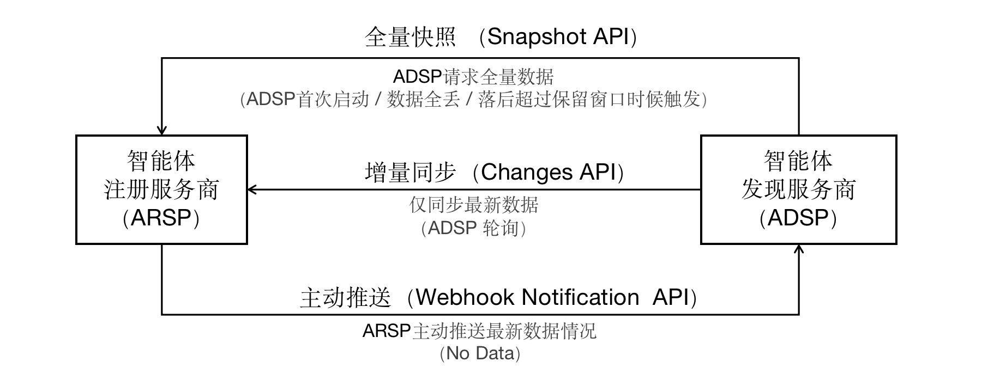

[首页](../README.md)

DRC：发现与注册数据同步协议（ACPs-spec-DRC-v01.00）

# 1. 文档定义

本文档为 ACPs 智能体协作协议体系中的发现与注册数据同步协议（Discovery Registry Coordination Protocol, DRC）标准定义，版本号 v01.00。

文档全称为 ACPs-spec-DRC-v01.00。

文档编写者：禹可（北京邮电大学），胡晓峰（北京邮电大学），郭小练（北京邮电大学），宋昊哲（北京邮电大学），马镝（北京邮电大学）。

# 2. 协议基础概念

- **智能体注册服务商（Agent Registration Service Provider，ARSP）**  
智能体注册服务商是​​数据的源头​​，负责智能体数据的​​上传、验证、批准、撤销及版本管理​​，确保数据的完整性、合法性与一致性。其核心职责还包括维护智能体的​​全局唯一标识（AIC）​​与​​版本历史​​，为ADSP提供可靠的数据基准。

- **智能体发现服务商（Agent Discovery Service Provider，ADSP）**  
  智能体发现服务商负责通过同步机制获取ARSP的数据，支撑智能体的搜索、分析与决策。一个ARSP可以为多个ADSP提供数据，一个ADSP也可以从多个ARSP拉取数据。

- **数据同步需求**
  - **​全量快照（Snapshot）​​**：ARSP向ADSP提供某一时刻的​​完整数据视图​​，用于​​初始化本地数据库​​或​​恢复数据一致性​​（如ADSP首次启动、本地数据全丢失）。
  - **增量变更（Changes）**：ARSP向ADSP推送​​新增或修改的数据​​（如op=upsert），用于​​保持实时同步​​（如ADSP定期轮询或ARSP主动推送）。
  - **保留窗口（Retention Window）​**​：ARSP保留数据的​​时间范围​​（如2天），若ADSP落后于保留窗口（如断联超过2天），需重新获取全量快照以重建完整数据视图。

---

# 3. 智能体注册服务商和智能体发现服务商的数据同步过程
当智能体发现服务首次启动、数据丢失或数据长期滞后于智能体注册服务商的注册数据时，应主动请求一次全量快照，完成数据的初始对齐。随后进入常态化运行，即ADSP以增量方式持续轮询ARSP，仅拉取新增或变更的数据，确保实时一致。若对数据同步的时效性要求更高，可改由ARSP主动推送变更，进一步降低发现侧的查询压力。若连接意外中断且时间较长，发现服务需再次拉取全量或增量快照，重新对齐数据，保障双方始终同步。

下图展示了ARSP和ADSP的三种数据同步方式：


## 3.1 全量快照同步
**触发场景**
当ADSP处于**首次启动、本地数据全丢失、落后ARSP的数据保留窗口** 时，需通过全量快照快速对齐数据。

**交互机制**
- ARSP生成包含某一时刻全量数据的`snapshot`（快照），通过响应头传递`X-Snapshot-Id`（快照唯一标识 ）、`X-Snapshot-Seq`（快照对应全局递增序号，标记数据时间点 ）、`Chunk`(分块信息)；
- 数据以`NDJSON`流形式返回，每条数据遵循`Envelope`结构（含`seq` 变更序号、`op` 操作类型、`type` 数据类型、`id` 唯一标识、`version` 版本、`payload` 实际数据内容 ）。
- ADSP先拉取首块数据，再通过`snapshot-id + chunk-index`分块拉取剩余内容；
- ADSP按做幂等更新（如检查version是否大于本地版本，重复、旧版本数据自动跳过 ），同步完成后记录`X-Snapshot-Seq`，作为后续增量同步起点。


## 3.2 增量快照同步
**触发场景**
全量快照同步完成后，进入增量同步循环，ADSP需实时获取ARSP最新数据变更，持续保持数据一致。

**交互机制**
- ADSP定期或长轮询（通过`wait` 参数 ）发起`GET /v1/changes?seq=last_seq` 请求，ARSP响应变更数据。
- 若有新变更（返回 200），ARSP以`NDJSON`流返回`Envelope`变更包，ADSP按幂等逻辑处理（跳过旧版本变更），同步完成更新`seq`，作为下次拉取的起点。
- 若空变更（返回 204 ），响应头`X-Next-Seq`不变，ADSP短暂休眠或重试。
- 若ADSP数据落后过多（返回 `410 Gone`，超出ARSP数据保留窗口 ），触发全量/增量快照数据同步方式（优先尝试增量快照，若不支持则重新全量同步 ）。

## 3.3 主动推送

**触发场景**
若ADSP端对数据实时性要求极高，或需减少ADSP轮询资源消耗的场景，可启用主动推送机制，由ARSP主动推送新数据消息。

**交互机制**

- ADSP先通过`POST /v1/webhooks`向 ARSP注册回调（含`回调地址 url`、`签名密钥 secret`、`关注数据类型 types`、`事件 events` 等 ），ARSP接收并返回 `webhook_id`、`status=active` 等注册状态；
- 后续ARSP监测到数据变更，主动向ADSP回调地址推送变更。
- ARSP推送变更时，携带签名（用 secret 校验防伪造 ），数据格式同 Changes API（Envelope结构 ）；
- ADSP接收后​​复用增量同步处理逻辑​​（幂等更新），确保数据一致性。


---

# 4.关键数据

## 4.1 数据模型（Envelope）
智能体注册服务商和智能体发现服务商传输的所有数据都使用统一的数据模型（Envelope），保证幂等性与可进化性。
- **​幂等性**​​：指同一操作无论执行多少次，结果均与一次执行一致，避免重复处理导致的数据不一致。例如，ADSP重复拉取全量快照时，通过seq（全局递增序号）判断数据是否已同步，重复数据将被自动跳过，确保本地数据不会因重复操作而冗余。
​- **​可进化性**​​：指数据模型能随业务需求变化灵活扩展，无需修改整体结构即可支持新增字段或功能。
```json
{
  "seq": "0000000042001", // 全局递增序号
  "ts": "2025-08-17T13:12:19Z", // 变更时间戳（可选）
  "op": "upsert | delete", // 操作类型（可选）。缺省为upsert。
  "type": "dataset | file | user ...", // 对象类型
  "id": "urn:reg:abc:dataset:123", // 对象全局唯一ID
  "version": 42, // 对象版本号，单对象内单调递增
  "payload": {
    /* 实际数据 */
  }
}
```
**Payload 类型**
Payload 字段可以有不同的类型，取决于具体实现。可以通过 info 的 API 端点查询当前支持的类型。

- `FULL_OBJ`：完整对象数据，包含所有字段。

- `OBJ_PATCH`：对象的部分更新数据，只包含变更的字段。遵循 JSON Patch 规范。https://jsonpatch.com/

Snapshot 和 Changes API 都使用这种 Envelope 结构。但是 Snapshot 的 payload 必须是 FULL_OBJ 类型（确保数据完整性），而 Changes 的 payload 可以是 FULL_OBJ 或 OBJ_PATCH 类型（根据变更类型选择，优化传输效率）。

## 4.2 快照（Snapshot）
Snapshot分为全量Snapshot和增量Snapshot两种类型，其中增量Snapshot是可选的。

**全量快照**
全量Snapshot是智能体注册服务商（ARSP）向智能体发现服务商（ADSP）提供某一时刻完整数据视图的机制。

通过 `GET /v1/snapshot?types=acs,dataset&limit=10000 `等请求，可以让ADSP直接拿到生成快照时刻的完整副本。其特点是能解决ADSP首次初始化、数据全丢、落后超保留窗口等场景，虽数据量大、同步耗时，但为数据对齐提供兜底方案，依赖​​软删除​​（如is_deleted字段标记），保障删除操作的一致性（避免物理删除导致数据丢失）

**增量快照**
增量Snapshot是指ARSP向ADSP提供​​某一时间段内的增量数据​，是一种​在客户端数据落后但不多、全量Snapshot耗时大时，用于快速追赶数据的可选机制。

通过 `GET /v1/snapshot?types=acs,dataset&from-seq=35000&limit=10000` 请求触发，仅返回 `from-seq` 之后新增或更新的数据。这种方式跳过已同步的大部分数据，可大幅减少传输数据量、加速同步。但它不支持物理删除操作（易致数据不一致 ），需依赖软删除（如 is_deleted 字段标记 ）配合。

---
# 5.接口设计
智能体注册服务商和智能体发现服务商的数据同步涉及的API如下表所示：
| API名称               | 是否可选 | 核心作用                                                                 |
|-----------------------|----------|--------------------------------------------------------------------------|
| Snapshot API          | 必选     | 提供某一时刻的全量数据视图（全量快照）或基于指定序号的增量数据视图（增量快照），用于初始化或恢复数据，支持分块传输。 |
| Changes API           | 必选     | 基于全局递增序号提供增量变更数据，使ADSP保持数据实时更新，支持长轮询减少空拉取。 |
| Info API              | 可选     | 提供ARSP的系统状态和配置信息，用于ADSP客户端的能力协商和运行时状态检查。 |
| Webhook Notification API | 可选     | 允许ADSP注册回调地址，当ARSP有数据变更时主动通知，减少轮询频率，提高同步实时性。 | 
