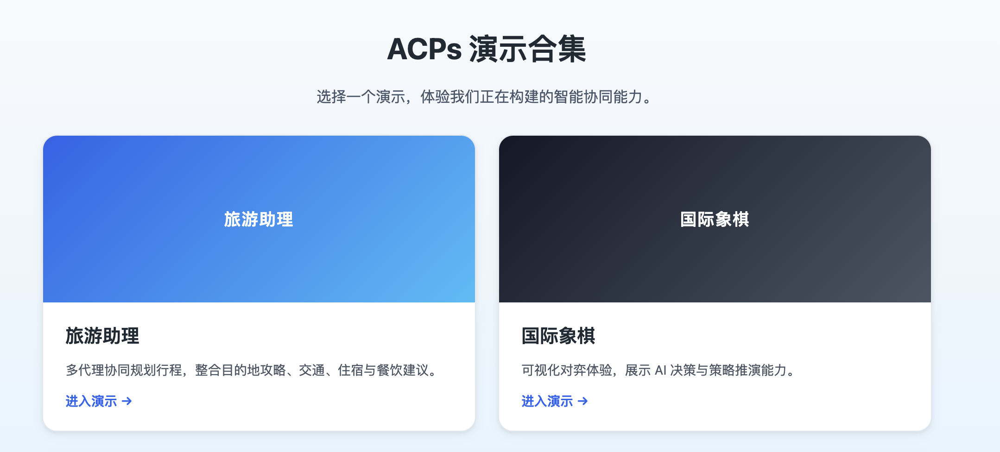

# 1.ACPs协议细节
所有ACPs协议文档均可通过 [协议文档汇总](../README.md) 访问。

# 2.服务端搭建

如果您想要搭建您自己的智能体注册服务器，请参考：[ ACPs Registry Server]()

如果您想要搭建您自己的智能体发现服务器，请参考：[ACPs Discovery Server]()

如果您想要搭建您自己的CA服务器，请参考：[ACPs CA Server]()

# 3.demo使用

为了您快速体验ACPs协议，我们提供了一个demo，其代码仓库位于 [demo-app]()。这里我们提供了能快速体验demo的流程。

**首先克隆demo代码仓库**

```bash
git clone [demo-url]
cd demo-apps
```
**创建虚拟环境并安装依赖**

```bash
python3.13 -m venv venv
source venv/bin/activate
pip install -r requirements.txt
```

**准备环境变量：**

```bash
cp .env.example .env
# 根据实际部署修改 openai/discovery 相关配置
```

**启动全部 Agent 与演示服务（首次运行可先确认证书路径等）：**

```bash
./start.sh
```

**在浏览器验证 Leader：**

用浏览器访问 `http://localhost:3000`。您可以看到如下界面，您可以分别体验旅游助理和国际象棋。




**查看运行日志：**

- 每个子服务在 `logs/` 下记录日志，可用 `tail -f logs/tour_assistant.log` 等命令查看。
- 若需查看所有服务的日志，可运行 `tail -f logs/*.log`。


